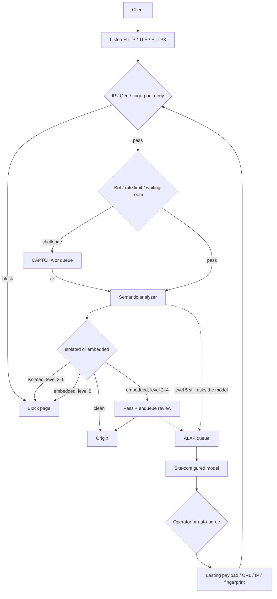

<p align="center">
  
</p>

<h1 align="center">CheeseWAF</h1>

<p align="center"><em>AI on patrol. Cheese stays whole.</em></p>

<p align="center">
  <strong>ALAP</strong> · AI Large-Language-Model Auto Pilot<br>
  A next-generation, self-hosted WAF driven by a large language model.<br>
  WEB + Control Panel + CLI. Your origin stays yours.
</p>

<p align="center">
  <a href="README.md">English</a> ·
  <a href="README_CN.md">简体中文</a>
</p>

<p align="center">
  <a href="LICENSE">Apache-2.0</a>
</p>

<p align="center">
  <a href="https://github.com/LaokeQwQ/CheeseWAF/stargazers"></a>
  <a href="https://github.com/LaokeQwQ/CheeseWAF/network/members"></a>
  <a href="https://github.com/LaokeQwQ/CheeseWAF/watchers"></a>
  <a href="https://github.com/LaokeQwQ/CheeseWAF/issues"></a>
  <a href="https://github.com/LaokeQwQ/CheeseWAF/pulls"></a>
  <a href="LICENSE"></a>
  <br>
  <a href="go.mod"></a>
  <a href="https://github.com/LaokeQwQ/CheeseWAF/releases"></a>
  <a href="https://github.com/LaokeQwQ/CheeseWAF/commits"></a>
  <a href="https://github.com/LaokeQwQ/CheeseWAF/actions/workflows/ci.yml"></a>
  
  
  
</p>

> Pre-release. CheeseWAF is an **ALAP** (AI Large-Language-Model Auto Pilot) WAF: the data plane decides in microseconds, then a site-configured model pilots review, auto-agree, and lasting rules. Config and APIs can still change.

## Menu

- [Why ALAP](#why-alap)
- [WEB + Control Panel + CLI](#web--control-panel--cli)
- [Traffic path](#traffic-path)
- [Protection levels](#protection-levels)
- [Install](#install)
- [Configuration](#configuration)
- [Tech stack](#tech-stack)
- [Development](#development)
- [Documentation](#documentation)
- [License](#license)

## Why ALAP

Most WAFs stop at a rule hit. CheeseWAF treats that hit as the start of an autopilot loop.

1. A staged semantic engine reads **one decoded field**, not the whole HTTP message.
2. Isolated gadgets (almost only attack bytes, thin wrappers like `@`, trailing `;`, `/{${...}}`) can block from level 2.
3. The same bytes inside an article pass at levels 2–4. Only level 5 blocks them on the spot.
4. Anything suspicious still goes to the review queue. The site’s own model writes a verdict in the background. It never stalls the request.
5. An operator — or auto-agree, when you turn it on — turns that verdict into a lasting payload, URL, IP, or fingerprint rule.

You bring the model endpoint. CheeseWAF does not hard-code a vendor. The model is not a CMS takedown bot. Lasting action stays inside the WAF.

## WEB + Control Panel + CLI

One admin API. Three doors in.

| Surface | What you get |
| --- | --- |
| **WEB** | Browser UI. Desktop and phone share the same app. |
| **Control Panel** | Sites, rules, review, logs, maps, cluster. Day-to-day ops. |
| **CLI** | `waf-cli` on the release binary (`./waf-cli` → `./cheesewaf cli`) |

All three share RBAC, revocable sessions, and the audit log.

## Traffic path

Every request walks this path. Dashed lines are ALAP: they run after the response is already on its way.



Default listeners after a local start:

| Plane | Address |
| --- | --- |
| Data plane | `http://127.0.0.1:8080` |
| Admin setup | `http://127.0.0.1:9443/setup` · Docker uses `https://127.0.0.1:9443/setup` |

## Protection levels

Site field: `waf.paranoia_level`. New sites default to **3**. An omitted YAML value is 3. An explicit `0` stays record-only.

| Level | Isolated gadget | Embedded in prose |
| --- | --- | --- |
| 0–1 | record only | record only |
| 2–4 | block | pass, ask the model, enqueue review |
| 5 | block | block, still ask the model |

Level 4 can briefly promote the site to level 5 after an embedded hit (`promote_seconds`). That window lives in SQLite and survives restart.

A level-5 item that is already blocked can still receive a lasting payload, URL, IP, or fingerprint rule. Allow stays pending-only.

Client fingerprint is `SHA-256(User-Agent + "\n" + Accept-Language)`, first 8 bytes as 16 hex characters. It is not JA3.

Details: [docs/protection-policy-roadmap.md](docs/protection-policy-roadmap.md).

## Install

Use the **release tarball + systemd** first. Compose is the one-box alternative. Multi-node uses a generated Ansible playbook.

### 1. Release package and systemd (recommended)

CI publishes channel packages on `dev`, `canary`, and `master`:

`cheesewaf-<version>-<os>-<arch>.tar.gz`

Each archive is one folder: `cheesewaf`, `waf-cli`, embedded `web/dist`, example `configs/`, `VERSION`.

```bash
tar -xzf cheesewaf-*-linux-amd64.tar.gz
cd cheesewaf-*

sudo install -m 0755 cheesewaf /usr/local/bin/cheesewaf
sudo ln -sf /usr/local/bin/cheesewaf /usr/local/bin/waf-cli

sudo mkdir -p /etc/cheesewaf /var/lib/cheesewaf /var/log/cheesewaf
sudo cp configs/cheesewaf.yaml /etc/cheesewaf/cheesewaf.yaml
sudo cp deploy/systemd/cheesewaf.service /etc/systemd/system/cheesewaf.service

sudo useradd --system --home /var/lib/cheesewaf --shell /usr/sbin/nologin cheesewaf
sudo chown -R cheesewaf:cheesewaf /etc/cheesewaf /var/lib/cheesewaf /var/log/cheesewaf

sudo systemctl daemon-reload
sudo systemctl enable --now cheesewaf
```

The unit in [deploy/systemd/cheesewaf.service](deploy/systemd/cheesewaf.service) runs:

```text
/usr/local/bin/cheesewaf serve --config /etc/cheesewaf/cheesewaf.yaml
```

The release tarball may not include `deploy/systemd/`. Copy that unit from this repository, or write one with the `ExecStart` above.

Then open the setup wizard, create the first admin, and point the sample site at your origin.

Windows operators can use the zip (`cheesewaf.exe serve`) or the NSIS installer.

### 2. Docker Compose (optional one-box)

Use this when you want a disposable full instance, not as the default production shape.

```bash
git clone https://github.com/LaokeQwQ/CheeseWAF.git
cd CheeseWAF
docker compose -f deploy/docker/docker-compose.yml up -d --build
docker compose -f deploy/docker/docker-compose.yml logs -f cheesewaf
```

Open `https://127.0.0.1:9443/setup`. The image uses a self-signed admin certificate. The first-run token is only in the start log.

```bash
docker compose -f deploy/docker/docker-compose.yml down
```

Named volumes keep data. `down` does not delete them.

### 3. Multi-node Ansible

There is no checked-in `deploy/ansible/` tree. The admin plane **generates** a playbook from a cluster plan:

`POST /api/cluster/deploy/ansible`

The zip has `inventory.ini`, `playbook.yml`, a systemd role, and a config template. It does not embed SSH passwords or join tokens. You supply SSH through your own inventory or agent:

```bash
ansible-playbook -i inventory.ini playbook.yml
```

Two WAF nodes in that package are load balancing, not full HA.

### From source (developers)

Needs **Go 1.26.6** and **Node.js 24.18.0**.

```bash
git clone https://github.com/LaokeQwQ/CheeseWAF.git
cd CheeseWAF
cd web && npm ci && npm run build && cd ..
go run ./cmd/cheesewaf serve
```

## Configuration

A first start writes `data/cheesewaf.yaml`. The example is [configs/cheesewaf.yaml](configs/cheesewaf.yaml).

| Section | Role |
| --- | --- |
| `server` | Data-plane and admin listen addresses and TLS |
| `sites` | Domains, origins, detection policy, allowlists, rewrite |
| `protection` | Global levels, IP, rate limit, bot, API security |
| `storage` / `logging` / `monitor` | Database, log backends, metrics and alerts |
| `ai` | Site model used by ALAP review, auto-agree, and the console |

Admin binds `127.0.0.1` by default. A public bind needs both `server.admin_public: true` and admin TLS.

## Tech stack

| Layer | Choice |
| --- | --- |
| Data plane | Go 1.26, `chi`, YAML v3, quic-go (HTTP/3) |
| Detection | In-process staged semantic analyzer, custom rules |
| ALAP | Site-configured chat HTTP (completions or messages style), async review queue |
| Storage | SQLite by default (`modernc.org/sqlite`), optional PostgreSQL log sink |
| Admin API | Same binary, Bearer sessions, RBAC |
| Web / mobile | React 18, TypeScript, Vite, Tailwind, shadcn/Radix, TanStack Query |
| Terminal | Cobra + Bubble Tea (`waf-cli`) |
| Ship | Single static binary, systemd, Docker, Windows zip / NSIS, generated Ansible |

## Development

```bash
go test ./cmd/... ./internal/...
go vet ./cmd/... ./internal/...

cd web
npm ci
npm run typecheck
npm test
npm run build
```

Replay built-in samples:

```bash
go run ./cmd/cheesewaf-corpus --mode analyzer
go run ./cmd/cheesewaf-corpus --mode http --base-url http://127.0.0.1:8080
```

Integration path: `feature/*` → `dev` → `canary` → `master`. Merge only after required checks are green.

## Documentation

| Document | Topic |
| --- | --- |
| [docs/protection-policy-roadmap.md](docs/protection-policy-roadmap.md) | Levels 0–5, review queue, what we will not do |
| [docs/paranoia-level-implementation.md](docs/paranoia-level-implementation.md) | How those levels are wired |
| [docs/performance-optimization.md](docs/performance-optimization.md) | Runtime and analyzer notes |

## License

[Apache License 2.0](LICENSE).
