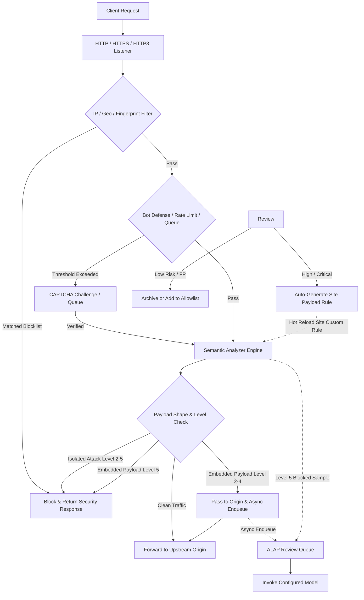

<p align="center">
  
</p>

<h1 align="center">CheeseWAF</h1>

<p align="center"><em>You hold the keys. AI keeps the cheese.</em></p>

<p align="center">
  Intelligent Web Application Firewall powered by <strong>ALAP</strong><br>
  <strong>Self-hosted · Lightweight · High-concurrency</strong><br>
  Sub-millisecond inline mitigation paired with autonomous out-of-band threat review
</p>

<p align="center">
  <a href="README.md">English</a> ·
  <a href="README_CN.md">简体中文</a>
</p>

<p align="center">
  <a href="LICENSE"></a>
  <a href="go.mod"></a>
  <a href="https://github.com/LaokeQwQ/CheeseWAF/releases"></a>
  <a href="https://github.com/LaokeQwQ/CheeseWAF/actions/workflows/ci.yml"></a>
  <a href="https://github.com/LaokeQwQ/CheeseWAF/stargazers"></a>
  <a href="https://github.com/LaokeQwQ/CheeseWAF/issues"></a>
</p>

---

## Table of Contents

- [Core Mechanism](#core-mechanism)
- [Architecture & Ecosystem](#architecture--ecosystem)
- [Features](#features)
- [Request Processing Pipeline](#request-processing-pipeline)
- [Paranoia Levels](#paranoia-levels)
- [Hardware Recommendations](#hardware-recommendations)
- [Deployment](#deployment)
  - [1. Linux Deployment (Systemd Production)](#1-linux-deployment-systemd-production)
  - [2. Docker Deployment (Docker Compose)](#2-docker-deployment-docker-compose)
  - [3. Windows Deployment (CLI, Zip, NSIS)](#3-windows-deployment-cli-zip-nsis)
  - [4. macOS Deployment (DMG & Portable Tarball)](#4-macos-deployment-dmg--portable-tarball)
- [Quick Start](#quick-start)
- [Gateways & Adapters](#gateways--adapters)
- [Security Plugins & Resource Packages](#security-plugins--resource-packages)
- [Management Interfaces](#management-interfaces)
- [Configuration Reference](#configuration-reference)
- [Tech Stack](#tech-stack)
- [Production Build Guidelines](#production-build-guidelines)
- [Development & Testing](#development--testing)
- [Corpus Governance & Security Evaluation](#corpus-governance--security-evaluation)
- [Documentation](#documentation)
- [License](#license)

---

## Core Mechanism

Traditional regex-based WAFs rely on large signature rule sets that require high maintenance and remain vulnerable to encoding evasion or false positives. Conversely, sending every request synchronously to a large language model introduces prohibitive proxy latency.

CheeseWAF uses a decoupled two-plane design:

1. **Inline Mitigation (Data Plane)**: An in-process Abstract Syntax Tree (AST) semantic engine decodes parameters and evaluates syntactic structures in sub-millisecond time, immediately blocking deterministic exploits such as SQL injection and XSS.
2. **Asynchronous Review (ALAP Engine)**: **ALAP (AI Large-Language-Model Auto Pilot)** sends borderline, ambiguous, or embedded payloads to a background review queue after responses are delivered to clients. The configured model analyzes samples out-of-band without adding proxy latency.
3. **Dynamic Rule Synthesis**: When auto-adoption is enabled for a site, high-confidence malicious findings (`high` or `critical`) are automatically transformed into persistent custom payload rules for that site, protecting subsequent traffic. Global IP bans and client fingerprint blocks remain explicit operator decisions.

**Storage and Runtime Profile**: CheeseWAF stores management state in embedded SQLite by default (`storage.profile: temporary`), providing a standalone setup with zero external database dependencies. It also supports an optional asynchronous PostgreSQL log sink (`storage.postgresql`) for centralized enterprise audit and telemetry. To enforce strict fail-closed safety, selecting `storage.profile: production` enforces environment verification and fails closed with `ErrProductionStorageUnavailable` to prevent accidental insecure fallbacks.

---

## Architecture & Ecosystem

CheeseWAF maintains distinct operational boundaries across the core engine, gateway adapters, and plugin specifications:

```text
Client Request
      │
      ▼
Reverse Proxy / API Gateway (NGINX / Envoy / Kubernetes Ingress)
      │
      ├─ auth_request / ext_authz (HTTP Contract)
      ▼
Gateway Adapter (CheeseWAF-Adapters / adapterd)
      │
      ├─ X-CheeseWAF-Adapter-Token
      ▼
CheeseWAF Core Engine
  ├─ Data Plane: Sub-millisecond AST parsing, rate limiting, Bot defense
  ├─ Management Plane: Web Console, REST API, interactive CLI (waf-cli)
  ├─ Asynchronous Queue: ALAP model review and rule feedback
  ├─ Plugin Management: CRP v1 offline verification and local staging
  └─ Storage State: Embedded SQLite / optional PostgreSQL log sink
```

- **Core Engine (CheeseWAF)**: Handles traffic proxying, semantic inspection, rate limiting, administrative operations, and background ALAP auditing.
- **Gateway Adapters ([CheeseWAF-Adapters](https://github.com/LaokeQwQ/CheeseWAF-Adapters))**: A lightweight Go daemon (`adapterd`) deployed as a sidecar alongside API gateways or reverse proxies. It converts gateway requests into CheeseWAF inspection contracts, enforcing fail-closed protection without requiring you to replace existing infrastructure.
- **Security Plugin Ecosystem ([CheeseSec_Plugin](https://github.com/LaokeQwQ/CheeseSec_Plugin))**: Implements the CRP v1 (CheeseWAF Resources Package) specification. Packages use Ed25519 multi-signatures, strict source-root bindings, and monotonic release sequences to enable secure, offline-verifiable rule and model distribution.

---

## Features

- **AST Semantic Analysis**: Multi-stage decoding and AST parsing detect SQL injection, XSS, command execution, and code injection without brittle regular expressions.
- **ALAP Asynchronous Auditing**: Background queues invoke standard-compatible model endpoints without adding proxy latency to live HTTP traffic.
- **0–5 Paranoia Levels**: Distinguishes between isolated exploit payloads and attacks embedded inside long text fields, with support for temporary elevation windows (`promote_seconds`).
- **Access Control & Bot Defense**: Built-in IP allow/block lists, GeoIP blocking, client soft fingerprinting, slider CAPTCHA challenges, and sharded sliding-window rate limiting.
- **Decoupled Gateway Integration**: Works with `CheeseWAF-Adapters` to support NGINX, Envoy, and Kubernetes Ingress.
- **Cryptographic Plugin Verification**: Built-in CRP v1 parser verifies Ed25519 signatures and stages assets into content-addressed local slots.
- **Unified Tri-Interface Management**: Responsive Web UI, interactive terminal CLI (`waf-cli`), and RESTful API backed by a single RBAC and audit logging core.
- **Zero-Dependency Storage**: Embedded SQLite operates out of the box; asynchronous PostgreSQL streaming is available for external audit storage.

---

## Request Processing Pipeline

Solid lines denote the inline millisecond data plane; dashed lines represent post-response asynchronous ALAP auditing and site custom rule updates:



### Default Network Listeners

| Plane | Default Address | Description |
| :--- | :--- | :--- |
| **Data Plane** | `http://127.0.0.1:8080` | Ingress listener for incoming Web traffic and reverse proxying |
| **Admin Plane** | `http://127.0.0.1:9443` | Web UI, RESTful API, and setup wizard (`https://` in Docker) |
| **Cluster Plane** | `https://127.0.0.1:9444` | Optional TLS/mTLS node interconnect when `cluster.enabled: true` for health checks and topology discovery |

---

## Paranoia Levels

The paranoia level is configured per site via `waf.paranoia_level` (valid values: **0–5**, default: **3**).

> **Two independent settings:**
> - `waf.paranoia_level` (0–5) controls how strictly the **semantic engine** evaluates input structures.
> - `protection_policy.web_attack` (`off` / `low` / `smart` / `high` / `strict`, default `smart`) sets the **proxy-level response policy**, including risk score aggregation, alerting thresholds, and timeout behavior.
> - In access logs, `waf_policy_decision.paranoia_level` records the site sensitivity level (0–5) and `waf_policy_decision.policy_tier` records the response strategy tier (0–4).

The analyzer inspects **individual decoded parameter values** (paths and parameter names remain visible) and categorizes attack patterns into two structural shapes:
- **Isolated Payload**: The inspected parameter value consists almost entirely of exploit syntax (e.g., `UNION SELECT 1,2,3` in a search parameter).
- **Embedded Payload**: Attack patterns appear inside ordinary text, user comments, or descriptions (e.g., discussing code snippets in a technical forum).

### Paranoia Level Matrix

| Level | Name | Isolated Payload | Embedded Payload | Dynamic Elevation | Mechanism & Target Scenario |
| :---: | :--- | :--- | :--- | :---: | :--- |
| **0** | Record Only | Log only | Log only | No | Initial baseline profiling and traffic discovery. |
| **1** | Low Monitoring | Log only | Log only | No | Staging environments, rule dry-runs, and false-positive auditing. |
| **2** | Low-Medium | **Block immediately** | **Pass to origin**, async review | No | UGC platforms, forums, and editors requiring low false-positive rates. |
| **3** | Standard (Default) | **Block immediately** | **Pass to origin**, async review | No | Standard production web apps and corporate portals. Blocks confirmed exploits. |
| **4** | Medium-High | **Block immediately** | **Pass to origin**, async review | **Supported** (elevates to Level 5) | Critical systems under probing. Temporarily elevates to Level 5 via `promote_seconds`. |
| **5** | Strict Mitigation | **Block immediately** | **Block immediately**, async review | N/A (Highest level) | Financial APIs, payment backends, and active emergency mitigation. |

> **Notes:**
> 1. **Dynamic Elevation (`promote_seconds`)**: Under Level 4, detecting embedded attack patterns can trigger a temporary elevation to Level 5 for a specified window (e.g., 300 seconds). The deadline is persisted locally and remains active across restarts.
> 2. **Level 5 Constraints**: Samples blocked under Level 5 enter the audit queue with status `blocked` and cannot be retroactively allowed, but can be converted into permanent block rules.

---

## Hardware Recommendations

The initial setup wizard performs a host probe (up to 30 seconds) to determine suitable resource defaults based on logical CPU cores, visible memory, and disk sequential write throughput:

- **Low (`low`)**: Logical cores <= 2, memory <= 2048 MB, or unverified disk write throughput. Recommended for 2-core / 2 GB cloud VMs.
- **Medium (`medium`)**: At least 3 logical cores, at least 4096 MB memory, and verified sequential disk writes.
- **High (`high`)**: At least 4 logical cores, at least 8192 MB memory, and sequential write throughput >= 50 MB/s.
- **Smart (`smart`)**: Manually selected adaptive profile. If the environment probe times out or encounters an error, the wizard defaults to recommending `low`.

The profile sets baseline protection levels and rate-limit thresholds without adding unverified experimental parameters.

---

## Deployment

CheeseWAF provides flexible deployment models across major operating systems and infrastructure environments.

### 1. Linux Deployment (Systemd Production)

Recommended for Linux physical servers and virtual machines requiring minimal resource overhead and high throughput.

#### Step 1: Download and Extract Release Archive

Download the official release archive matching your server architecture from the [Releases](https://github.com/LaokeQwQ/CheeseWAF/releases) page:

| Archive Name | Architecture |
| :--- | :--- |
| `cheesewaf-amd64-linux-*.tar.gz` | Linux x86_64 |
| `cheesewaf-arm64-linux-*.tar.gz` | Linux ARM64 |
| `cheesewaf-loong64-linux-*.tar.gz` | Linux LoongArch |

```bash
# Example for Linux x86_64
tar -xzf cheesewaf-amd64-linux-*.tar.gz
cd cheesewaf-*
```

#### Step 2: Install Binary and Web Assets

Use the bundled automated installer:

```bash
sudo ./install-linux.sh
```

For manual installation, copy both the binary executable and the Web administration assets:

```bash
sudo install -m 0755 cheesewaf /usr/local/bin/cheesewaf
sudo ln -sf /usr/local/bin/cheesewaf /usr/local/bin/waf-cli
sudo mkdir -p /usr/share/cheesewaf/web /etc/cheesewaf /var/lib/cheesewaf /var/log/cheesewaf
sudo cp -R web/dist/. /usr/share/cheesewaf/web/
sudo install -m 0640 configs/cheesewaf.yaml /etc/cheesewaf/cheesewaf.yaml
sudo useradd --system --home /var/lib/cheesewaf --shell /usr/sbin/nologin cheesewaf
sudo chown -R cheesewaf:cheesewaf /etc/cheesewaf /var/lib/cheesewaf /var/log/cheesewaf
```

#### Step 3: Register Systemd Service

Copy the service unit file to the system directory:

```bash
sudo cp systemd/cheesewaf.service /etc/systemd/system/cheesewaf.service
```

The service unit runs as the unprivileged `cheesewaf` user and grants `CAP_NET_BIND_SERVICE` to bind ports 80 and 443 safely.

#### Step 4: Start Service and Verify

```bash
# Reload service definitions and enable auto-start
sudo systemctl daemon-reload
sudo systemctl enable --now cheesewaf

# Inspect service status
sudo systemctl status cheesewaf
```

The administrative interface binds to `127.0.0.1:9443` by default. Access `http://127.0.0.1:9443/setup` locally or via an SSH tunnel. Initial setup requires a setup token; use the full URL from the protected `setup.url` runtime file.

---

### 2. Docker Deployment (Docker Compose)

Suitable for containerized environments. Builds an unprivileged container with a read-only root filesystem using `deploy/docker/Dockerfile`.

#### Step 1: Prepare Compose File

Create `docker-compose.yml`:

```yaml
services:
  cheesewaf:
    image: cheesewaf:latest
    build:
      context: .
      dockerfile: deploy/docker/Dockerfile
    user: "10001:10001"
    restart: unless-stopped
    read_only: true
    cap_drop:
      - ALL
    security_opt:
      - no-new-privileges:true
    tmpfs:
      - /tmp:size=32m,mode=1777,noexec,nosuid,nodev
    ports:
      - "8080:8080"
      - "127.0.0.1:9443:9443"
    volumes:
      - cheesewaf-data:/var/lib/cheesewaf
      - cheesewaf-logs:/var/log/cheesewaf
    healthcheck:
      test: ["CMD", "/usr/local/bin/cheesewaf-entrypoint", "healthcheck"]
      interval: 30s
      timeout: 5s
      retries: 3

volumes:
  cheesewaf-data:
  cheesewaf-logs:
```

#### Step 2: Start Containers

```bash
docker compose up -d
docker compose logs -f cheesewaf
```

#### Step 3: Access Setup Wizard

Navigate to `https://127.0.0.1:9443/setup` on the host machine (containers generate self-signed certificates by default). The `cheesewaf-data` volume persists configuration and rules across container upgrades.

---

### 3. Windows Deployment (CLI, Zip, NSIS)

Designed for desktop testing and local operations:

- **Option A: Standalone CLI**: Download `cheesewaf-amd64-windows-*.exe` and run `.\cheesewaf.exe setup` and `.\cheesewaf.exe serve` directly in PowerShell.
- **Option B: Portable ZIP**: Extract the archive to access default configuration files and run `.\cheesewaf.exe serve --data-dir .\data`.
- **Option C: NSIS Installer**: Run the setup wizard to register CheeseWAF as a managed Windows service with a system tray controller.

---

### 4. macOS Deployment (DMG & Portable Tarball)

1. Download the installer image matching your hardware: `cheesewaf-arm64-darwin-*.dmg` (Apple Silicon) or `cheesewaf-amd64-darwin-*.dmg` (Intel).
2. Open the DMG and drag **CheeseWAF** into the Applications folder.
3. Launch the application to start the menu bar controller, offering one-click service management and Web console access.
4. Runtime data is stored in `~/Library/Application Support/CheeseWAF`. For headless servers, use the CLI tarball release directly.

---

## Quick Start

### 1. Initialize System

After starting the service, open the initialization URL in your browser:
- Copy the complete link containing the token from the protected `setup.url` runtime file (e.g., `http://127.0.0.1:9443/setup#setup_token=...`). The wizard automatically sends the token via headers and strips it from the address bar.
- Create the primary administrator account. Note the administrator password; console authentication enforces strict complexity checks.

### 2. Add Reverse Proxy Site

In the Web console, navigate to **Sites** -> **Add Site**:
1. **Domain**: Enter the public domain name (e.g., `demo.example.com`).
2. **Upstream Origin**: Configure the backend server IP and port (e.g., `192.168.1.100:8080`).
3. **Protection Policy**: Select the initial paranoia level (Level 3 is recommended for general workloads).
4. **Save**: Configuration changes take effect immediately via hot reload without restarting the process.

### 3. Configure Model Review (ALAP)

Navigate to **AI Settings**:
1. **Endpoint**: Enter an OpenAI- or Anthropic-compatible API endpoint (e.g., `https://api.example.com/v1`). Private network endpoints require enabling private API access.
2. **Credentials**: Supply the API key and specify the target model name.
3. **Auto-Adoption**: Enable auto-adoption per site under site settings to automatically promote high-confidence malicious findings into permanent custom rules.

---

## Gateways & Adapters

To integrate CheeseWAF with existing API gateways or reverse proxies without changing your routing topology, deploy [CheeseWAF-Adapters](https://github.com/LaokeQwQ/CheeseWAF-Adapters).

### Integration Concept

`CheeseWAF-Adapters` provides `adapterd`, a lightweight Go daemon that runs alongside your gateway as a sidecar. The gateway forwards subrequests or authorization requests (e.g., NGINX `auth_request`, Envoy `ext_authz`) to `adapterd`, which calls the CheeseWAF core contract at `/api/v1/check` and translates verdicts back into gateway responses.

### NGINX Configuration Example

Start `adapterd`:

```bash
adapterd --listen 127.0.0.1:9080 --core-url http://127.0.0.1:8080
```

Add the following subrequest block to your NGINX server configuration:

```nginx
location / {
    auth_request /cheesewaf-check;
    proxy_pass http://backend_upstream;
}

location = /cheesewaf-check {
    internal;
    proxy_pass http://127.0.0.1:9080/check;
    proxy_pass_request_body off;
    proxy_set_header Content-Length "";
    proxy_set_header X-Original-URI $request_uri;
    proxy_set_header X-Original-Method $request_method;
    proxy_set_header X-Real-IP $remote_addr;
}
```

### Security & Resilience

- **Token Authentication**: When `CHEESEWAF_ADAPTER_TOKEN` is configured, adapter requests must supply the dedicated `X-CheeseWAF-Adapter-Token` HTTP header.
- **Fail-Closed Design**: If CheeseWAF core becomes unreachable, `adapterd` returns `503 Service Unavailable` by default, preventing uninspected traffic from slipping through.

---

## Security Plugins & Resource Packages

CheeseWAF supports distributing and applying custom rules and models via [CheeseSec_Plugin](https://github.com/LaokeQwQ/CheeseSec_Plugin). Packages adhere to the CRP v1 (CheeseWAF Resources Package) specification.

### CRP v1 Specification

- **Archive Layout**: A valid `.crp` package strictly contains `manifest.json`, `signatures/manifest.json`, and an `artifact/<file>` entry.
- **Signatures**: Uses Ed25519 cryptographic signatures with threshold policies (e.g., official packages require a 2-of-3 threshold).
- **Integrity Controls**: Manifests declare SHA-256 identity digests, transfer checksums, and monotonic `release_sequence` values to prevent rollbacks and replay attacks.

### CLI Commands

The CheeseWAF CLI provides offline verification and controlled staging:

```bash
# 1. Verify signatures and source registration offline
cheesewaf crp verify \
  --package ./rules-pack.crp \
  --trust-roots ./trust-roots.json \
  --sources ./sources.json \
  --now 2026-09-06T12:00:00Z

# 2. Stage verified package into local protected storage (stages without executing)
cheesewaf crp stage \
  --package ./rules-pack.crp \
  --trust-roots ./trust-roots.json \
  --sources ./sources.json \
  --runtime-dir /var/lib/cheesewaf/crp-runtime \
  --now 2026-09-08T12:00:00Z
```

Packages with missing signatures or unregistered sources are rejected by the core admission layer.

---

## Management Interfaces

CheeseWAF provides three unified management interfaces:

| Interface | Best For | Authentication & Mechanics |
| :--- | :--- | :--- |
| **Web Console** | Day-to-day operations, traffic dashboards, and rule management | Browser-based, responsive design with guided setup wizards |
| **Terminal CLI** | Shell automation, headless servers, and rapid debugging | `waf-cli` binary supporting subcommands and interactive TUI |
| **RESTful API** | CI/CD automation and enterprise platform integration | Standard HTTP API authenticated via Bearer tokens with audit trails |

---

## Configuration Reference

On first run, the daemon creates `data/config/cheesewaf.yaml` (template available in [configs/cheesewaf.yaml](configs/cheesewaf.yaml)). Primary configuration keys include:

```yaml
server:
  listen: "127.0.0.1:8080"       # Data plane ingress listener
  admin_listen: "127.0.0.1:9443" # Administration interface listener
  admin_public: false             # Exposing externally requires TLS configuration

sites:
  - id: "site-demo"
    name: "Demo Site"
    domains: ["demo.example.com"]
    upstreams:
      - address: "192.168.1.100:8080"
        weight: 1
    waf:
      enabled: true
      mode: "block"              # block, monitor, or off
      paranoia_level: 3          # Paranoia Level (0–5)
      semantic_policy:
        auto_agree: true         # Auto-adopt high-confidence model verdicts
      access_control:
        trusted_cidrs: []        # Trusted proxy CIDR blocks

protection:
  ratelimit:
    enabled: true
    default:
      requests: 100
      window: 60s
      burst: 20
  ip:
    blacklist: []
    whitelist: ["127.0.0.1", "::1"]

ai:
  enabled: true
  provider: "openai"
  api_base: "https://api.example.com/v1"
  model: "provider-default"
```

### Rule Import and Export

Custom rules are scoped to `sites[].waf.custom_rules`. You can manage them via the console or CLI:

```bash
# Display rule schema example
waf-cli --config ./data/config/cheesewaf.yaml rules example --format yaml

# Import site custom rules (validates and deduplicates before applying)
waf-cli --config ./data/config/cheesewaf.yaml rules import --site default --file custom_rules.yaml

# Export active site rules
waf-cli --config ./data/config/cheesewaf.yaml rules export --site default --format json
```

The process monitors `cheesewaf.yaml` modification times and reloads rules automatically. You can also send `SIGHUP` to trigger an immediate reload. If a new rule set fails compilation, previous rules remain in effect.

---

## Tech Stack

| Component | Technology |
| :--- | :--- |
| **Data Plane** | Go 1.26, `chi` router, quic-go (HTTP/3 support) |
| **Inspection Engine** | In-process AST semantic analyzer, dynamic fingerprinting, sharded sliding-window rate limiting |
| **Review Engine** | Asynchronous in-memory & durable queues, standard protocol adapters |
| **Storage** | Embedded SQLite management storage (zero external dependencies); optional PostgreSQL async log sink |
| **Web Console** | React 18, TypeScript, Vite, Tailwind CSS, shadcn/ui, TanStack Query |
| **Terminal CLI** | Cobra CLI framework, Bubble Tea terminal UI |

---

## Production Build Guidelines

When building production assets from source, build frontend assets exclusively via `bash scripts/ci/build-web.sh`. This script excludes local debugging tools and developmental scripts, ensuring production packages remain clean and terminating the build if non-production markers are detected.

---

## Development & Testing

### Prerequisites

- Go `1.26` or higher
- Node.js `24.x` and npm

### Build Commands

```bash
# 1. Clone repository
git clone https://github.com/LaokeQwQ/CheeseWAF.git
cd CheeseWAF

# 2. Build Web static assets
bash scripts/ci/build-web.sh

# 3. Build backend executable
go build -o bin/cheesewaf ./cmd/cheesewaf

# 4. Create runtime configuration and start service
mkdir -p ./data/config
cp ./configs/cheesewaf.yaml ./data/config/cheesewaf.yaml
./bin/cheesewaf serve --config ./data/config/cheesewaf.yaml --data-dir ./data
```

### Automated Testing

```bash
# Backend unit tests
go test -v ./cmd/... ./internal/...
go vet ./cmd/... ./internal/...

# Frontend type checks and component tests
cd web && npm run typecheck && npm test && cd ..

# Acceptance smoke checks
bash scripts/acceptance/get-started.sh
```

---

## Corpus Governance & Security Evaluation

CheeseWAF maintains a governed test corpus pipeline. Datasets follow a strict progression: global deduplication -> structural triage -> semantic curation -> dual-stage cross-review.

```bash
# Audit available corpora and generate triage reports
make corpus-governance

# Build hash-pinned regression snapshots and run evaluation
make security-corpus
```

Automated CI gates require evaluation snapshots to contain at least 250 benign requests and 10,000 attack samples while enforcing a baseline of **FPR < 0.8%** and **TPR >= 99%**.

---

## Documentation

- [ACME Certificate Reload Profiles](docs/acme.md)
- [Protection Policy Specification](docs/protection-policy-roadmap.md)
- [Corpus Governance & Evaluation Platform](docs/semantic-corpus-governance.md)
- [Paranoia Level Code Mapping](docs/paranoia-level-implementation.md)
- [Performance Optimization Notes](docs/performance-optimization.md)
- [Windows Packaging Guide](deploy/windows/README.md)

---

## License

This project is licensed under the [Apache License 2.0](LICENSE).
