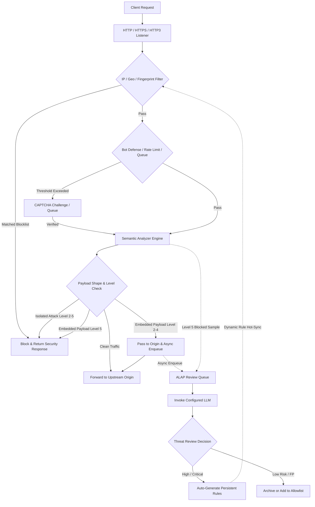

<p align="center">
  
</p>

<h1 align="center">CheeseWAF</h1>

<p align="center"><em>You hold the keys. AI keeps the cheese.</em></p>

<p align="center">
  <strong>ALAP</strong> · AI Large-Language-Model Auto Pilot<br>
  Self-hosted, lightweight, and high-concurrency intelligent WAF.<br>
  Let AI take the helm so you can focus where it matters.
</p>

<p align="center">
  <a href="README.md">English</a> ·
  <a href="README_CN.md">简体中文</a>
</p>

<p align="center">
  <a href="LICENSE"></a>
  <a href="go.mod"></a>
  <a href="https://github.com/LaokeQwQ/CheeseWAF/releases"></a>
  <a href="https://github.com/LaokeQwQ/CheeseWAF/actions/workflows/ci.yml"></a>
  <a href="https://github.com/LaokeQwQ/CheeseWAF/stargazers"></a>
  <a href="https://github.com/LaokeQwQ/CheeseWAF/issues"></a>
</p>

---

## Table of Contents

- [Core Mechanism](#core-mechanism)
- [Features](#features)
- [Request Processing Pipeline](#request-processing-pipeline)
- [Paranoia Levels](#paranoia-levels)
- [Deployment](#deployment)
  - [1. Linux Deployment (Systemd Production)](#1-linux-deployment-systemd-production)
  - [2. Docker Deployment (Docker Compose)](#2-docker-deployment-docker-compose)
  - [3. Windows Deployment (Portable Zip & NSIS Installer)](#3-windows-deployment-portable-zip--nsis-installer)
- [Quick Start](#quick-start)
- [Management Interfaces](#management-interfaces)
- [Configuration Reference](#configuration-reference)
- [Tech Stack](#tech-stack)
- [Development & Testing](#development--testing)
- [Documentation](#documentation)
- [License](#license)

---

## Core Mechanism

Traditional regex-based WAFs rely on large signature rule sets that require high maintenance and remain susceptible to false positives or evasion techniques. Conversely, invoking LLMs synchronously on every incoming request introduces substantial latency.

CheeseWAF uses a decoupled pipeline:

1. **Inline Mitigation (Data Plane):** An in-process semantic engine decodes parameters and performs Abstract Syntax Tree (AST) lexical analysis to block deterministic exploits in sub-millisecond time.
2. **Asynchronous Review (ALAP Engine):** With **ALAP (AI Large-Language-Model Auto Pilot)**, ambiguous, borderline, or embedded payloads are dispatched to a background review queue for deeper LLM inspection after responses are served, providing autonomous oversight without adding proxy latency.
3. **Dynamic Rule Synthesis:** High-confidence malicious findings (`high` or `critical`) generated by the model can be automatically promoted into persistent IP, fingerprint, or signature rules applied to the data plane.

The entire system ships as a standalone binary with embedded SQLite storage, an integrated Web console, a terminal TUI tool, and a RESTful administration API.

---

## Features

- **Semantic Analysis**: Identifies SQL injection, XSS, and command injection attacks using multi-stage decoding and AST parsing instead of rigid regex patterns.
- **ALAP Asynchronous Auditing**: Works with any OpenAI-compatible API or local LLM gateway in background worker queues without adding latency to live HTTP traffic.
- **0–5 Paranoia Levels**: Per-site sensitivity controls that differentiate between isolated attack payloads and patterns embedded inside long text fields, with support for temporary elevation windows (`promote_seconds`).
- **Access Control & Bot Mitigation**: Built-in IP allow/deny lists, GeoIP blocking, client soft fingerprinting, slider CAPTCHA challenges, token-bucket rate limiting, and waiting rooms.
- **Unified Tri-Interface Management**: Responsive Web UI (desktop and mobile), interactive terminal interface (`waf-cli`), and RESTful API backed by a single RBAC and audit logging core.
- **Zero External Dependencies**: Written in pure Go with an embedded CGO-free SQLite database (`modernc.org/sqlite`).

---

## Request Processing Pipeline

Solid lines denote the inline millisecond data plane; dashed lines represent post-response asynchronous ALAP auditing and rule sync:



### Default Network Listeners

| Plane | Default Address | Description |
| :--- | :--- | :--- |
| **Data Plane** | `http://127.0.0.1:8080` | Ingress listener for incoming Web traffic and reverse proxying |
| **Admin Plane** | `http://127.0.0.1:9443` | Web UI, RESTful API, and setup wizard (`https://` in Docker) |
| **Cluster Plane** | `http://127.0.0.1:9444` | Node interconnect and state synchronization in cluster mode |

---

## Paranoia Levels

The paranoia level is configured per site via `waf.paranoia_level` (valid values: **0–5**, default: **3**).

The analyzer inspects **individual decoded parameter values** (paths and parameter names remain visible) and categorizes detected attack signatures into two structural shapes:
- **Isolated Payload**: The inspected parameter value consists almost entirely of exploit syntax (e.g., `UNION SELECT 1,2,3`, allowing minimal wrappers like `@` or trailing semicolons).
- **Embedded Payload**: The attack pattern appears inside ordinary text, user comments, articles, or descriptions.

### Paranoia Level Matrix

| Level | Name | Isolated Payload | Embedded Payload | Dynamic Elevation | Mechanism & Target Scenario |
| :---: | :--- | :--- | :--- | :---: | :--- |
| **0** | Record Only | Log only | Log only | No | Initial baseline profiling and traffic discovery. |
| **1** | Low Monitoring | Log only | Log only | No | Staging environments, rule dry-runs, and false-positive auditing. |
| **2** | Low-Medium | **Block immediately** | **Pass to origin**, async review | No | UGC platforms, forums, rich text editors with zero false positive tolerance. |
| **3** | Standard (Default) | **Block immediately** | **Pass to origin**, async review | No | Standard production web apps and corporate portals. |
| **4** | Medium-High | **Block immediately** | **Pass to origin**, async review | **Supported** (elevates to Level 5) | Critical systems under probing. Temporarily elevates to Level 5 via `promote_seconds`. |
| **5** | Strict Mitigation | **Block immediately** | **Block immediately**, async review | N/A (Already highest) | Financial APIs, payment backends, and active emergency mitigation. |

> **Notes:**
> 1. **Dynamic Elevation (`promote_seconds`)**: Under Level 4, detecting embedded attack patterns can trigger a temporary elevation to Level 5 for a specified window (e.g., 300 seconds). The elevation deadline is persisted in SQLite across service restarts.
> 2. **Level 5 Constraints**: Level 5 blocked samples are enqueued for audit with status `blocked` and cannot be retroactively allowed, but can be converted into permanent block rules (payloads, URLs, IPs, client fingerprints).

---

## Deployment

CheeseWAF provides three independent deployment methods. Choose the one that suits your infrastructure:

### 1. Linux Deployment (Systemd Production)

Recommended for Linux physical servers and virtual machines for direct execution and low resource consumption.

#### Step 1: Download and Extract Release Archive

Download the release package for your architecture from the [Releases](https://github.com/LaokeQwQ/CheeseWAF/releases) page:

```bash
# Example for Linux x86_64 (amd64)
tar -xzf cheesewaf-*-linux-amd64.tar.gz
cd cheesewaf-*
```

#### Step 2: Install Executable and Configure Directories

```bash
# Install binary and create CLI symlink
sudo install -m 0755 cheesewaf /usr/local/bin/cheesewaf
sudo ln -sf /usr/local/bin/cheesewaf /usr/local/bin/waf-cli

# Set up configuration and working directories
sudo mkdir -p /etc/cheesewaf /var/lib/cheesewaf /var/log/cheesewaf
sudo cp configs/cheesewaf.yaml /etc/cheesewaf/cheesewaf.yaml

# Create service user and set ownership
sudo useradd --system --home /var/lib/cheesewaf --shell /usr/sbin/nologin cheesewaf
sudo chown -R cheesewaf:cheesewaf /etc/cheesewaf /var/lib/cheesewaf /var/log/cheesewaf
```

#### Step 3: Configure Systemd Service

Create `/etc/systemd/system/cheesewaf.service`:

```ini
[Unit]
Description=CheeseWAF Service
After=network.target network-online.target
Wants=network-online.target

[Service]
Type=simple
User=cheesewaf
Group=cheesewaf
ExecStart=/usr/local/bin/cheesewaf serve --config /etc/cheesewaf/cheesewaf.yaml --data-dir /var/lib/cheesewaf
Restart=always
RestartSec=3s
LimitNOFILE=65535
ProtectSystem=full
ProtectHome=true
PrivateTmp=true

[Install]
WantedBy=multi-user.target
```

#### Step 4: Start and Verify Service

```bash
# Reload systemd and enable on boot
sudo systemctl daemon-reload
sudo systemctl enable --now cheesewaf

# Check service status
sudo systemctl status cheesewaf
```

Navigate to `http://<SERVER_IP>:9443/setup` to complete initial setup.

---

### 2. Docker Deployment (Docker Compose)

Recommended for containerized deployments. The container runs as a non-root user (UID `10001`) with a read-only root filesystem.

#### Step 1: Create Compose File

Save the following as `docker-compose.yml`:

```yaml
services:
  cheesewaf:
    image: cheesewaf:latest
    build:
      context: .
      dockerfile: deploy/docker/Dockerfile
    user: "10001:10001"
    restart: unless-stopped
    read_only: true
    cap_drop:
      - ALL
    security_opt:
      - no-new-privileges:true
    tmpfs:
      - /tmp:size=32m,mode=1777,noexec,nosuid,nodev
    ports:
      - "8080:8080"
      - "9443:9443"
    volumes:
      - cheesewaf-data:/var/lib/cheesewaf
      - cheesewaf-logs:/var/log/cheesewaf
    healthcheck:
      test: ["CMD", "/usr/local/bin/cheesewaf-entrypoint", "healthcheck"]
      interval: 30s
      timeout: 5s
      retries: 3

volumes:
  cheesewaf-data:
  cheesewaf-logs:
```

#### Step 2: Start Container

```bash
# Start container in detached mode
docker compose up -d

# View logs and retrieve initial setup token
docker compose logs -f cheesewaf
```

#### Step 3: Access Admin Interface

- Open `https://<HOST_IP>:9443/setup` in your browser (admin uses HTTPS with a self-signed certificate in Docker).
- Copy the temporary onboarding token from the container startup logs.
- Data and logs persist in `cheesewaf-data` and `cheesewaf-logs` volumes across container restarts.

---

### 3. Windows Deployment (Portable Zip & NSIS Installer)

CheeseWAF provides portable binaries and an NSIS graphical installer for Windows environments:

#### Option A: Portable CLI Package (Zip)

1. Download `cheesewaf-*-windows-amd64.zip` and extract to a target directory (e.g., `D:\CheeseWAF`).
2. Run the following in PowerShell:

```powershell
# Start WAF process
.\cheesewaf.exe serve --config .\configs\cheesewaf.yaml --data-dir .\data

# Check running status
.\cheesewaf.exe status

# Stop process
.\cheesewaf.exe stop
```

#### Option B: NSIS Graphical Installer

1. Run `CheeseWAF-Setup-<version>.exe`.
2. Follow the setup wizard to complete the installation.
3. The uninstaller preserves user configuration and databases under `data\` by default.

#### Local Service Controller (`cheesewaf-gui`)

Windows releases bundle a lightweight local GUI controller bound strictly to loopback (`127.0.0.1:17943`):
- Start, stop, and restart the backend WAF process.
- Inspect process PID and operational status.
- Open the Web management console or configuration directory directly.
- Configure user-login autostart via the Windows Registry.

---

## Quick Start

### 1. Initial Setup

Open the setup URL after starting the service:
- `http://127.0.0.1:9443/setup` (`https://127.0.0.1:9443/setup` in Docker)
- Create your administrator account and save the system key.

### 2. Add a Protected Site

In the Web console, go to **Sites** -> **Add Site**:
1. **Domain**: Enter your public domain (e.g., `example.com`).
2. **Upstream**: Enter the internal IP and port of your origin application (e.g., `10.0.0.10:8000`).
3. **Protection Level**: Select Paranoia Level 3 for standard deployments.
4. **Save**: Configuration is applied immediately without restarting the service.

### 3. Configure AI Autopilot (ALAP)

In **AI Settings**:
1. **Endpoint**: Enter your LLM provider endpoint (e.g., `https://api.openai.com/v1`).
2. **API Key & Model**: Enter credentials and select the target model.
3. **Auto-Agree**: Enable auto-commit for high-confidence threats if you want automated rule creation.

---

## Management Interfaces

| Interface | Form Factor | Primary Usage |
| :--- | :--- | :--- |
| **Web Console** | Responsive Web application (desktop and mobile) | Site configuration, rule orchestration, threat dashboards, log analysis, AI review queue |
| **Terminal CLI** | Interactive TUI & command tools (`waf-cli`) | Headless server management, configuration reloading, process status checks |
| **RESTful API** | HTTP API with Bearer Token authentication | CI/CD pipelines, automated deployments, custom integrations |

---

## Configuration Reference

A default `cheesewaf.yaml` file is generated upon first startup (reference template: [configs/cheesewaf.yaml](configs/cheesewaf.yaml)):

```yaml
server:
  listen: "0.0.0.0:8080"         # Data plane ingress listener
  admin_listen: "127.0.0.1:9443"   # Admin plane listener
  admin_public: false            # Set true only with admin TLS configured

sites:
  - id: "site-demo"
    name: "Demo Site"
    domains: ["demo.example.com"]
    upstreams:
      - address: "192.168.1.100:8080"
        weight: 1
    waf:
      paranoia_level: 3          # Paranoia Level (0–5)

protection:
  rate_limit:
    enabled: true
    requests_per_second: 100
  ip_block:
    enabled: true

ai:
  enabled: true
  provider: "openai"
  endpoint: "https://api.example.com/v1"
  model: "gpt-4o-mini"
  auto_agree: true               # Auto-commit high-confidence review verdicts
```

---

## Tech Stack

| Layer | Component |
| :--- | :--- |
| **Data Plane** | Go 1.26, `chi` routing, quic-go (HTTP/3 support) |
| **Detection Core** | In-process AST semantic analyzer, dynamic fingerprinting, token-bucket rate limiter |
| **Review Engine** | Asynchronous task queues, standard Chat Completions / Messages protocol adapters |
| **Storage** | Embedded SQLite (`modernc.org/sqlite`, pure Go), optional PostgreSQL sink |
| **Web Console** | React 18, TypeScript, Vite, Tailwind CSS, shadcn/ui, TanStack Query |
| **Terminal CLI** | Cobra CLI library, Bubble Tea TUI framework |

---

## Development & Testing

### Requirements

- Go `1.26` or higher
- Node.js `24.x` and npm

### Build Pipeline

```bash
# 1. Clone repository
git clone https://github.com/LaokeQwQ/CheeseWAF.git
cd CheeseWAF

# 2. Build Web frontend static assets
cd web
npm ci
npm run build
cd ..

# 3. Build backend binary
go build -o bin/cheesewaf ./cmd/cheesewaf

# 4. Run
./bin/cheesewaf serve --config ./configs/cheesewaf.yaml
```

### Verification & Corpus Tests

```bash
# Run backend tests
go test -v ./cmd/... ./internal/...
go vet ./cmd/... ./internal/...

# Frontend type checking and tests
cd web && npm run typecheck && npm test && cd ..

# Replay bundled security test corpus against the analyzer
go run ./cmd/cheesewaf-corpus --mode analyzer
```

---

## Documentation

- [Protection Policy & Roadmap](docs/protection-policy-roadmap.md)
- [Paranoia Level Code Mapping](docs/paranoia-level-implementation.md)
- [Performance Optimization Notes](docs/performance-optimization.md)
- [Windows Packaging Guide](deploy/windows/README.md)

---

## License

This project is licensed under the [Apache License 2.0](LICENSE).
