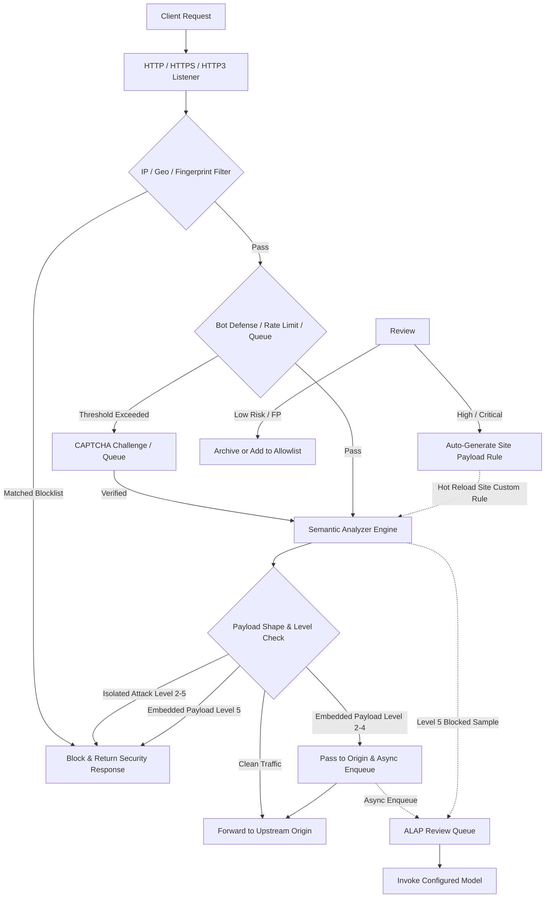

<p align="center">
  
</p>

<h1 align="center">CheeseWAF</h1>

<p align="center"><em>You hold the keys. AI keeps the cheese.</em></p>

<p align="center">
  Intelligent Web Application Firewall powered by <strong>ALAP</strong><br>
  <strong>Self-hosted · Lightweight · High-concurrency</strong><br>
  Sub-millisecond inline mitigation paired with autonomous out-of-band threat review
</p>

<p align="center">
  <a href="README.md">English</a> ·
  <a href="README_CN.md">简体中文</a>
</p>

<p align="center">
  <a href="LICENSE"></a>
  <a href="go.mod"></a>
  <a href="https://github.com/LaokeQwQ/CheeseWAF/releases"></a>
  <a href="https://github.com/LaokeQwQ/CheeseWAF/actions/workflows/ci.yml"></a>
  <a href="https://github.com/LaokeQwQ/CheeseWAF/stargazers"></a>
  <a href="https://github.com/LaokeQwQ/CheeseWAF/issues"></a>
</p>

---

<p align="center">
  <a href="#why-cheesewaf">⚡ Why CheeseWAF</a> ·
  <a href="#quick-start">🚀 Quick Start</a> ·
  <a href="#deployment">📦 Deployment</a> ·
  <a href="#gateways--adapters">🔌 Gateways & Adapters</a> ·
  <a href="#configuration-reference">⚙️ Configuration</a>
</p>

<details>
<summary><strong>📑 Table of Contents (Click to expand)</strong></summary>

- **Overview**: [Why CheeseWAF](#why-cheesewaf) · [Core Mechanism (ALAP)](#core-mechanism) · [Architecture & Ecosystem](#architecture--ecosystem) · [Features](#features) · [Request Pipeline](#request-processing-pipeline)
- **Setup & Operations**: [Hardware Recommendations](#hardware-recommendations) · [Quick Start](#quick-start) · [Linux Systemd](#1-linux-deployment-systemd-production) · [Docker Compose](#2-docker-deployment-docker-compose) · [Windows](#3-windows-deployment-cli-zip-nsis) · [macOS](#4-macos-deployment-dmg--portable-tarball)
- **Gateway & Ecosystem**: [Paranoia Levels (0–5)](#paranoia-levels) · [Gateway Adapters (adapterd)](#gateways--adapters) · [CRP Offline Security Plugins](#security-plugins--resource-packages) · [Management UI](#management-interfaces)
- **Reference & Dev**: [Configuration](#configuration-reference) · [Tech Stack](#tech-stack) · [Production Build](#production-build-guidelines) · [Development & Testing](#development--testing) · [Corpus Governance](#corpus-governance--security-evaluation) · [Documentation](#documentation)

</details>

---

## Why CheeseWAF

Modern Web security solutions usually force teams into painful tradeoffs:
1. **Traditional Regex WAFs (e.g., ModSecurity / CRS)**: Maintaining thousands of regular expressions is tedious. Attackers bypass signatures using character case variations, malformed encodings, or SQL comments. False positives are frequent, forcing operators to constantly tune exception lists.
2. **Synchronous LLM WAFs**: Routing every HTTP request to an LLM adds 500 ms to 2 s of latency to each response, burns API token budgets, and risks full outages whenever external endpoints experience latency spikes.
3. **Heavy Container Stacks (e.g., SafeLine / 雷池)**: Requiring 5 to 10 Docker containers (Tengine, Postgres, Redis, management daemons) consuming 1 to 2 GB+ of RAM, which quickly overburdens budget cloud instances and small VPSs.
4. **Commercial Cloud WAFs (e.g., Cloudflare / Cloud Provider WAFs)**: All traffic must route through third-party infrastructure, raising privacy, data residency, and compliance concerns. Bandwidth billing is unpredictable, and air-gapped operation is impossible.

CheeseWAF takes a balanced approach: **an in-process AST semantic parser provides sub-millisecond inline blocking, while an out-of-band LLM auto-pilot (ALAP) reviews ambiguous samples in the background and synthesizes persistent custom rules without adding latency to live requests.**

### Comparison Overview

| Dimension | Regex WAF (e.g., ModSecurity) | Synchronous LLM WAF | Heavy Container Stack | Commercial Cloud WAF | CheeseWAF |
| :--- | :--- | :--- | :--- | :--- | :--- |
| **Detection Engine** | Regex pattern matching | Synchronous LLM per request | Regex + statistical analysis | Signature sets + threat feed | **AST syntax analysis + Async LLM Auto-Pilot (ALAP)** |
| **Inline Latency Added** | 1–10 ms | **500–2000 ms** (high) | 2–15 ms | Dependent on CDN routing | **< 1 ms** (sub-millisecond, zero model wait) |
| **API / Token Cost** | None | Extremely high (all traffic) | None | Bandwidth & tier billing | **Low** (reviews only ambiguous samples out-of-band) |
| **Evasion & False Positives** | Easily bypassed by encodings | Prone to hallucinations | Complex rule maintenance | Vendor-dependent updates | **Parses syntax trees; immune to obfuscation; FPR < 0.8%** |
| **Footprint & Deployment** | Requires custom Nginx build | External API dependency | 5–10 containers, 1–2 GB+ RAM | Cloud-only | **Single binary / single container, embedded SQLite, tens of MB RAM** |
| **Architectural Disruption** | Bound to web server | Modifies primary traffic path | Replaces primary gateway | DNS / reverse proxy takeover | **Runs as standalone reverse proxy or sidecar via `adapterd`** |
| **Data Privacy & Compliance** | Local | Full traffic sent to external API | Local | Traffic traverses public cloud | **100% on-premises; optional private self-hosted LLM** |
| **Air-gapped Environments** | Supported | Not supported (requires cloud API) | Partially supported | Not supported | **Fully supported with offline Ed25519 CRP verification** |

---

## Core Mechanism

CheeseWAF decouples request proxying from deep intelligence into two distinct layers:

1. **Inline Data Plane (Sub-Millisecond Blocking)**: An in-process Abstract Syntax Tree (AST) engine parses parameters and inspects syntax trees in sub-millisecond time, immediately blocking deterministic exploits like SQL injection, XSS, and command injection.
2. **Asynchronous Review Plane (ALAP Engine)**: After normal responses return to clients, ALAP (AI Large-Language-Model Auto Pilot) routes ambiguous samples to a background queue for deep model evaluation without slowing down online traffic.
3. **Dynamic Rule Synthesis**: When auto-adoption is enabled, high-confidence malicious findings (`high` or `critical`) automatically convert into site-specific custom block rules for future traffic. Global IP bans and client fingerprint blocks remain operator decisions.

> **Storage Profile**: Uses embedded SQLite by default (`storage.profile: temporary`), requiring zero external database setup; access logs can stream asynchronously to external PostgreSQL. If `storage.profile: production` is explicitly set, an external production database must be configured; if missing, the service fails closed with `ErrProductionStorageUnavailable` at startup to prevent writing production state into temporary storage.

---

## Architecture & Ecosystem

CheeseWAF consists of three primary components:

```text
Client Request
      │
      ▼
Reverse Proxy / API Gateway (NGINX / Envoy / Kubernetes Ingress)
      │
      ├─ auth_request / ext_authz (HTTP Protocol)
      ▼
Gateway Adapter (CheeseWAF-Adapters / adapterd)
      │
      ├─ X-CheeseWAF-Adapter-Token
      ▼
CheeseWAF Core Engine
  ├─ Data Plane: Sub-millisecond AST parsing, rate limiting, Bot defense
  ├─ Management Plane: Web Console, REST API, CLI (waf-cli)
  ├─ Asynchronous Queue: ALAP model review and rule feedback
  ├─ Plugin Management: CRP v1 offline verification and local staging
  └─ Storage State: Embedded SQLite / optional PostgreSQL log sink
```

- **Core Engine (CheeseWAF)**: Handles reverse proxying, AST inspection, rate limiting, administrative operations, and background ALAP auditing.
- **Gateway Adapters ([CheeseWAF-Adapters](https://github.com/LaokeQwQ/CheeseWAF-Adapters))**: A standalone `adapterd` daemon. Deploys via `auth_request` or `ext_authz` alongside existing NGINX, Envoy, or Kubernetes Ingress setups without replacing gateways.
- **Security Resource Packages ([CheeseSec_Plugin](https://github.com/LaokeQwQ/CheeseSec_Plugin))**: Implements the CRP v1 specification. Packages use Ed25519 multi-signatures and monotonic version sequences to support fully offline verification.

---

## Features

- **AST Semantic Analysis**: Restores syntax trees to catch SQL injection, XSS, and command execution without regex false positives or bypass flaws.
- **ALAP Asynchronous Review**: Evaluates ambiguous samples out-of-band via model APIs without increasing live proxy latency.
- **0–5 Paranoia Levels**: Distinguishes between isolated exploit payloads and attacks embedded inside long text fields, with temporary escalation windows (`promote_seconds`).
- **Access Control & Bot Defense**: Built-in IP allow/block lists, GeoIP blocking, client soft fingerprinting, slider CAPTCHAs, and sharded sliding-window rate limiting.
- **Flexible Gateway Integration**: Operates as a standalone reverse proxy or sidecar integration for NGINX, Envoy, and Kubernetes Ingress via `adapterd`.
- **Offline Security Plugins**: Supports CRP v1 offline packages with Ed25519 signature checks and rollback protection.
- **Tri-Interface Management**: Responsive Web UI, interactive terminal CLI (`waf-cli`), and REST API.
- **Zero-Dependency Footprint**: Embedded SQLite engine operates out of the box with tens of megabytes of baseline memory.

---

## Request Processing Pipeline

Solid lines denote inline data forwarding; dashed lines represent post-response asynchronous ALAP auditing and rule updates:


```mermaid
flowchart TB
  Client[Client Request] --> Ingress[HTTP / HTTPS / HTTP3 Listener]
  Ingress --> IP{IP / Geo / Fingerprint Filter}
  IP -->|Matched Blocklist| Block[Block & Return Security Response]
  IP -->|Pass| Bot{Bot Defense / Rate Limit / Queue}
  Bot -->|Threshold Exceeded| Challenge[CAPTCHA Challenge / Queue]
  Challenge -->|Verified| Sem
  Bot -->|Pass| Sem[Semantic Analyzer Engine]
  Sem --> Shape{Payload Shape & Level Check}
  Shape -->|Isolated Attack Level 2-5| Block
  Shape -->|Embedded Payload Level 5| Block
  Shape -->|Embedded Payload Level 2-4| Pass[Pass to Origin & Async Enqueue]
  Shape -->|Clean Traffic| Origin[Forward to Upstream Origin]
  Pass --> Origin
  Pass -.->|Async Enqueue| Queue[ALAP Review Queue]
  Sem -.->|Level 5 Blocked Sample| Queue
  Queue --> LLM[Invoke Configured Model]
  Review -->|High / Critical| Rule[Auto-Generate Site Payload Rule]
  Review -->|Low Risk / FP| Dismiss[Archive or Add to Allowlist]
  Rule -.->|Hot Reload Site Custom Rule| Sem
```

### Default Network Listeners

| Plane | Default Address | Description |
| :--- | :--- | :--- |
| **Data Plane** | Configuration-defined (sample: `http://127.0.0.1:8080`) | Ingress listener for incoming Web traffic and reverse proxying |
| **Admin Plane** | Configuration-defined (installer profile binds `0.0.0.0:9443` and advertises a host) | Web UI, RESTful API, and setup wizard; use the installer output or `server.admin_listen` |
| **Cluster Plane** | `https://127.0.0.1:9444` | Optional TLS/mTLS node interconnect when `cluster.enabled: true` for health checks and topology discovery |

---

## Paranoia Levels

The paranoia level is configured per site via `waf.paranoia_level` (valid values: **0–5**, default: **3**).

> **Configuration Roles:**
> - `waf.paranoia_level` (0–5): controls how strictly the **semantic engine** evaluates input structures.
> - `protection_policy.web_attack` (`off` / `low` / `smart` / `high` / `strict`): sets the **response strategy**, including risk score aggregation and timeout fallback.
> - Access logs record these in `waf_policy_decision.paranoia_level` and `waf_policy_decision.policy_tier` respectively.

The analyzer inspects **individual decoded parameter values** (paths and parameter names remain visible) and categorizes attack patterns into two structural shapes:
- **Isolated Payload**: The inspected parameter value consists almost entirely of exploit syntax (e.g., `UNION SELECT 1,2,3` in a search parameter).
- **Embedded Payload**: Attack patterns appear inside ordinary text, user comments, or descriptions (e.g., discussing code snippets in a technical forum).

### Paranoia Level Matrix

| Level | Name | Isolated Payload | Embedded Payload | Dynamic Elevation | Target Scenario |
| :---: | :--- | :--- | :--- | :---: | :--- |
| **0** | Record Only | Log only | Log only | No | Initial baseline profiling and traffic discovery |
| **1** | Low Monitoring | Log only | Log only | No | Staging environments, rule dry-runs, and allowlist tuning |
| **2** | Low-Medium | **Block immediately** | **Pass to origin**, async review | No | UGC platforms, forums, and editors requiring low false-positive rates |
| **3** | Standard (Default) | **Block immediately** | **Pass to origin**, async review | No | Standard web apps and corporate portals; blocks confirmed exploits |
| **4** | Medium-High | **Block immediately** | **Pass to origin**, async review | **Supported** (elevates to Level 5) | Critical systems under probing; temporarily elevates via `promote_seconds` |
| **5** | Strict Mitigation | **Block immediately** | **Block immediately**, async review | N/A (Highest level) | Financial APIs, payment backends, and active emergency mitigation |

> **Notes:**
> 1. **Dynamic Elevation (`promote_seconds`)**: Under Level 4, detecting embedded attack patterns triggers temporary elevation to Level 5 for a specified window (e.g., 300 seconds). The deadline is persisted locally across restarts.
> 2. **Level 5 Constraints**: Samples blocked under Level 5 enter the audit queue with status `blocked` and cannot be retroactively allowed, but can be converted into permanent block rules.

---

## Hardware Recommendations

The setup wizard tests system performance and recommends an operational tier, which can also be adjusted anytime in the admin settings:

| Tier | Hardware Baseline | Description |
| :--- | :--- | :--- |
| **Low (`low`)** | 1–2 CPU cores / 1–2 GB RAM | Lightweight cloud hosts or small VPSs; requests that exceed inspection budgets automatically fall back here |
| **Smart (`smart`, default)** | 2–4 CPU cores / 4–8 GB RAM | Recommended for standard servers; dynamically tunes inspection depth based on request risk |
| **Medium (`medium`)** | Explicit selection | Fixed inspection depth 2 with a 50 ms timeout per request |
| **High (`high`)** | 4+ CPU cores / 8+ GB RAM | Core gateways; full deep semantic analysis |
| **Custom (`custom`)** | Explicit selection | Manual configuration of inspection depth and timeout budgets |

### Optional External Components

In addition to built-in features, CheeseWAF connects to external monitoring and storage services (testable during setup or configured later):
- **PostgreSQL**: Centralized access logs and audit trails.
- **VictoriaLogs**: High-performance structured log ingestion and querying.
- **Prometheus**: Metrics scraping endpoint.

---

## Deployment

CheeseWAF provides flexible deployment models across major operating systems.

### 1. Linux Deployment (Systemd Production)

Recommended for Linux physical servers and virtual machines requiring minimal resource overhead.

#### Recommended: One-command installation

Run this command as root on the target Linux host. It prompts for a language, detects the CPU architecture, downloads the latest stable release, verifies SHA256, installs and starts the systemd service, then prints public/private addresses, the one-time setup URL, paths, and service status:

```bash
curl -fsSL https://github.com/LaokeQwQ/CheeseWAF/releases/latest/download/install-linux.sh | sudo bash
```

The installer generates an ASCII alphanumeric security entry. Press Enter for a random value or enter a custom 8-64 character value. The public admin surface uses HTTPS and a one-time setup token; browsers warn about the self-signed certificate on first access, so production deployments should replace it with a trusted certificate or reverse proxy. It reports RFC1918/private interface addresses separately from a public candidate; set `CHEESEWAF_ADMIN_PUBLIC_HOST` when the public IP is provided by NAT or a DNS name. Expose only TCP 9443 in the cloud firewall. Secrets are shown only on an interactive terminal and are also saved in a root-only receipt.

#### Offline/manual installation

Download the official release archive matching your server architecture from the [Releases](https://github.com/LaokeQwQ/CheeseWAF/releases) page:

| Archive Name | Architecture |
| :--- | :--- |
| `cheesewaf-amd64-linux-*.tar.gz` | Linux x86_64 |
| `cheesewaf-arm64-linux-*.tar.gz` | Linux ARM64 |
| `cheesewaf-loong64-linux-*.tar.gz` | Linux LoongArch |

```bash
# Example for Linux x86_64
tar -xzf cheesewaf-amd64-linux-*.tar.gz
cd cheesewaf-*
```

#### Step 2: Install Binary and Web Assets

Use the bundled automated installer:

```bash
sudo ./install-linux.sh
```

For manual installation, copy both the binary executable and the Web administration assets:

```bash
sudo install -m 0755 cheesewaf /usr/local/bin/cheesewaf
sudo ln -sf /usr/local/bin/cheesewaf /usr/local/bin/waf-cli
sudo mkdir -p /usr/share/cheesewaf/web /etc/cheesewaf /var/lib/cheesewaf /var/log/cheesewaf
sudo cp -R web/dist/. /usr/share/cheesewaf/web/
# Initialize the runtime copy only when it does not already exist; edit this
# runtime file afterwards, never the tracked configs/cheesewaf.yaml template.
if [ ! -e /etc/cheesewaf/cheesewaf.yaml ]; then
  sudo install -m 0640 configs/cheesewaf.yaml /etc/cheesewaf/cheesewaf.yaml
fi
sudo useradd --system --home /var/lib/cheesewaf --shell /usr/sbin/nologin cheesewaf
sudo chown -R cheesewaf:cheesewaf /etc/cheesewaf /var/lib/cheesewaf /var/log/cheesewaf
```

#### Step 3: Register Systemd Service

Copy the service unit file to the system directory:

```bash
sudo cp systemd/cheesewaf.service /etc/systemd/system/cheesewaf.service
```

The service runs under a non-root user (`cheesewaf`) with `CAP_NET_BIND_SERVICE` capabilities to bind ports 80 and 443 safely.

#### Step 4: Start and Manage Service

```bash
# Reload service definitions and enable at boot
sudo systemctl daemon-reload
sudo systemctl enable --now cheesewaf

# Inspect status
sudo systemctl status cheesewaf
```

The installer binds the management interface to `0.0.0.0:9443` by default and prints both public and private addresses. The setup URL is short-lived; completing the wizard revokes its token, and the admin API then requires the generated security-entry cookie:

```bash
# View the initial setup URL containing the one-time access token:
cat /var/lib/cheesewaf/setup.url

# Reset the token if lost (valid only before creating the primary administrator):
sudo -u cheesewaf cheesewaf setup token reset
```

---

### 2. Docker Deployment (Docker Compose)

Use Docker Compose to deploy quickly in containerized environments. Containers run as a non-privileged non-root user (UID `10001`) with a read-only root filesystem.

#### Step 1: Prepare Compose File

Create `docker-compose.yml`:

```yaml
services:
  cheesewaf:
    image: cheesewaf:latest
    build:
      context: .
      dockerfile: deploy/docker/Dockerfile
    user: "10001:10001"
    restart: unless-stopped
    read_only: true
    cap_drop:
      - ALL
    security_opt:
      - no-new-privileges:true
    tmpfs:
      - /tmp:size=32m,mode=1777,noexec,nosuid,nodev
    ports:
      - "8080:8080"
      - "127.0.0.1:9443:9443"
    volumes:
      - cheesewaf-data:/var/lib/cheesewaf
      - cheesewaf-logs:/var/log/cheesewaf
    healthcheck:
      test: ["CMD", "/usr/local/bin/cheesewaf-entrypoint", "healthcheck"]
      interval: 30s
      timeout: 5s
      retries: 3

volumes:
  cheesewaf-data:
  cheesewaf-logs:
```

#### Step 2: Start Container

```bash
docker compose up -d
docker compose logs -f cheesewaf
```

#### Step 3: Access Setup Wizard

Open `https://127.0.0.1:9443/setup` in your browser to complete initialization (self-signed certificates are generated automatically). The `cheesewaf-data` volume persists configuration and rules across container upgrades.

---

### 3. Windows Deployment (CLI, Zip, NSIS)

Supports local development and running as a native Windows service:

- **Single Binary CLI**: Download `cheesewaf-amd64-windows-*.exe`, then run `.\cheesewaf.exe setup` and `.\cheesewaf.exe serve` in PowerShell.
- **Portable Zip**: Extract the archive and launch `.\cheesewaf.exe serve --data-dir .\data`.
- **NSIS Installer**: Registers CheeseWAF as a Windows background service and includes a system tray controller.

---

### 4. macOS Deployment (DMG & Portable Tarball)

Provides a status bar utility and command-line tools:

1. Download the installer for your architecture: `cheesewaf-arm64-darwin-*.dmg` (Apple Silicon) or `cheesewaf-amd64-darwin-*.dmg` (Intel).
2. Open the disk image and drag **CheeseWAF** into the Applications folder.
3. Launch the app to access tray controls for starting, stopping, and opening the Web Console.
4. Data is stored in `~/Library/Application Support/CheeseWAF`. Headless environments can run the CLI directly.

---

## Quick Start

### 1. Initial Setup

Open the installer-provided `https://PUBLIC_IP:9443/setup` URL (or its private address) for initial setup; afterwards use `https://PUBLIC_IP:9443/<security-entry>` to enter the console:
1. Enter the access token displayed in your terminal or `setup.url`.
2. Follow the on-screen prompts to create the primary administrator account.

### 2. Add Reverse Proxy Site

Log into the Web Console and navigate to **Sites** -> **New Site**:
1. Enter your domain (e.g., `demo.example.com`).
2. Enter the upstream server address and port (e.g., `192.168.1.100:8080`).
3. Select a paranoia level (Level 3 recommended for general production).
4. Save the configuration to hot-reload immediately without restarting the daemon.

### 3. Configure Model Endpoint (ALAP)

Navigate to **AI Settings**:
1. Enter an OpenAI-compatible endpoint URL (e.g., `https://api.example.com/v1`). Check the private network option if using a self-hosted local model.
2. Enter your API Key and model name.
3. Enable "Auto Adopt" under site settings if you want high-risk audit findings to automatically convert into site block rules.

---

## Gateways & Adapters

If your infrastructure already uses a reverse proxy or API gateway, you can integrate CheeseWAF without replacing your gateway by using [CheeseWAF-Adapters](https://github.com/LaokeQwQ/CheeseWAF-Adapters).

### Architecture

`CheeseWAF-Adapters` provides a lightweight daemon (`adapterd`) deployed as a sidecar alongside your gateway. The gateway forwards request metadata to `adapterd` via standard subrequests or auth filters (such as NGINX `auth_request` or Envoy `ext_authz`), which queries CheeseWAF at `/api/v1/check`.

### NGINX Integration Example

Start `adapterd`:

```bash
adapterd --listen 127.0.0.1:9080 --core-url http://127.0.0.1:8080
```

Add the following directives to your NGINX configuration:

```nginx
location / {
    auth_request /cheesewaf-check;
    proxy_pass http://backend_upstream;
}

location = /cheesewaf-check {
    internal;
    proxy_pass http://127.0.0.1:9080/check;
    proxy_pass_request_body off;
    proxy_set_header Content-Length "";
    proxy_set_header X-Original-URI $request_uri;
    proxy_set_header X-Original-Method $request_method;
    proxy_set_header X-Real-IP $remote_addr;
}
```

### Security & Fault Tolerance

- **Token Authentication**: When `CHEESEWAF_ADAPTER_TOKEN` is configured, requests must include the `X-CheeseWAF-Adapter-Token` header.
- **Fail-Closed Protection**: If the CheeseWAF core engine is unreachable, `adapterd` returns `503 Service Unavailable` by default, preventing uninspected traffic from reaching upstreams.

---

## Security Plugins & Resource Packages

CheeseWAF loads external security rules via [CheeseSec_Plugin](https://github.com/LaokeQwQ/CheeseSec_Plugin). Packages follow the CRP v1 (CheeseWAF Resources Package) specification using standard ZIP archives with Ed25519 digital signatures.

### CRP v1 Specification

- **Package Structure**: A valid `.crp` archive contains `manifest.json`, `signatures/manifest.json`, and `artifact/<file>`.
- **Digital Signatures**: Uses Ed25519 signatures and supports threshold policies (such as 2-of-3 signatures for official releases).
- **Integrity Validation**: Manifests declare a unique SHA-256 payload hash and a monotonic `release_sequence` to prevent version rollbacks and replay attacks.

### CLI Operations

The CheeseWAF CLI provides offline verification and staging commands:

```bash
# 1. Verify signatures and trust roots offline
cheesewaf crp verify \
  --package ./rules-pack.crp \
  --trust-roots ./trust-roots.json \
  --sources ./sources.json \
  --now 2026-09-06T12:00:00Z

# 2. Stage verified package into the protected runtime directory
cheesewaf crp stage \
  --package ./rules-pack.crp \
  --trust-roots ./trust-roots.json \
  --sources ./sources.json \
  --runtime-dir /var/lib/cheesewaf/crp-runtime \
  --now 2026-09-08T12:00:00Z
```

Packages that fail signature checks or originate from unregistered sources are rejected by the security engine.

---

## Management Interfaces

CheeseWAF provides three administrative interfaces:

| Interface | Best For | Authentication & Interaction |
| :--- | :--- | :--- |
| **Web Console** | Routine monitoring, rule adjustments, dashboard, log search | Web browser with responsive UI and step-by-step wizard |
| **Terminal CLI** | Automation scripts, headless servers, quick troubleshooting | Run `waf-cli`, supporting subcommands and full-screen TUI |
| **RESTful API** | CI/CD automation, internal DevOps platforms | Standard HTTP endpoints authenticated via Bearer tokens |

---

## Configuration Reference

On first launch, the daemon generates `data/config/cheesewaf.yaml` in the data directory (reference template: [configs/cheesewaf.yaml](configs/cheesewaf.yaml)). Core configuration structure:

```yaml
server:
  listen: "127.0.0.1:8080"       # Data plane ingress listener
  admin_listen: "0.0.0.0:9443"   # Public management listener used by the installer
  admin_public: true
  admin_tls:
    enabled: true
  # The installer writes a random security entry after bootstrap

sites:
  - id: "site-demo"
    name: "Demo Site"
    domains: ["demo.example.com"]
    upstreams:
      - address: "192.168.1.100:8080"
        weight: 1
    waf:
      enabled: true
      mode: "block"              # block / monitor / off
      paranoia_level: 3          # Paranoia level (0–5)
      semantic_policy:
        auto_agree: true         # Automatically adopt high-risk findings
      access_control:
        trusted_cidrs: []        # Trusted proxy CIDRs

protection:
  ratelimit:
    enabled: true
    default:
      requests: 100
      window: 60s
      burst: 20
  ip:
    blacklist: []
    whitelist: ["127.0.0.1", "::1"]

ai:
  enabled: true
  provider: "openai"
  api_base: "https://api.example.com/v1"
  model: "provider-default"
```

### Rule Batch Import & Export

Custom rules are stored under `sites[].waf.custom_rules`. You can manage them via the console or CLI:

```bash
# View rule YAML template
waf-cli --config ./data/config/cheesewaf.yaml rules example --format yaml

# Import custom rules (validates and deduplicates automatically)
waf-cli --config ./data/config/cheesewaf.yaml rules import --site default --file custom_rules.yaml

# Export active rules
waf-cli --config ./data/config/cheesewaf.yaml rules export --site default --format json
```

Configuration files hot-reload automatically upon file changes or when receiving a `SIGHUP` signal. If an imported rule contains syntax errors, the service continues running with its existing active rules.

---

## Tech Stack

| Module | Technologies |
| :--- | :--- |
| **Networking** | Go 1.26, `chi` router, quic-go (HTTP/3 support) |
| **Inspection Engine** | In-process AST semantic parser, client soft fingerprinting, sharded sliding-window rate limiting |
| **Asynchronous Review** | Memory and persistent queues, standard-compatible protocol adapters |
| **Storage** | Embedded SQLite state storage; optional asynchronous PostgreSQL log sink |
| **Frontend** | React 18, TypeScript, Vite, Tailwind CSS, shadcn/ui, TanStack Query |
| **Terminal Tooling** | Cobra CLI, Bubble Tea TUI framework |

---

## Production Build Guidelines

Production frontend assets must be built using `bash scripts/ci/build-web.sh`. This script excludes local debugging tools and developmental scripts, verifying artifact purity and failing if non-production markers are detected.

---

## Development & Testing

### Prerequisites

- Go `1.26` or higher
- Node.js `24.x` and npm

### Build Commands

```bash
# 1. Clone repository
git clone https://github.com/LaokeQwQ/CheeseWAF.git
cd CheeseWAF

# 2. Build Web static assets
bash scripts/ci/build-web.sh

# 3. Build backend executable
go build -o bin/cheesewaf ./cmd/cheesewaf

# 4. Create runtime configuration and start service
mkdir -p ./data/config
cp ./configs/cheesewaf.yaml ./data/config/cheesewaf.yaml
./bin/cheesewaf serve --config ./data/config/cheesewaf.yaml --data-dir ./data
```

### Automated Testing

```bash
# Backend unit tests
go test -v ./cmd/... ./internal/...
go vet ./cmd/... ./internal/...

# Frontend type checks and component tests
cd web && npm run typecheck && npm test && cd ..

# Acceptance smoke checks
bash scripts/acceptance/get-started.sh
```

---

## Corpus Governance & Security Evaluation

CheeseWAF maintains a governed test corpus pipeline. Datasets follow a strict progression: global deduplication -> structural triage -> semantic curation -> dual-stage cross-review.

```bash
# Audit available corpora and generate triage reports
make corpus-governance

# Build hash-pinned regression snapshots and run evaluation
make security-corpus
```

Automated CI gates require evaluation snapshots to contain at least 250 benign requests and 10,000 attack samples while enforcing a baseline of **FPR < 0.8%** and **TPR >= 99%**.

---

## Documentation

- [ACME Certificate Reload Profiles](docs/acme.md)
- [Protection Policy Specification](docs/protection-policy-roadmap.md)
- [Corpus Governance & Evaluation Platform](docs/semantic-corpus-governance.md)
- [Paranoia Level Code Mapping](docs/paranoia-level-implementation.md)
- [Performance Optimization Notes](docs/performance-optimization.md)
- [Windows Packaging Guide](deploy/windows/README.md)

---

## License

This project is licensed under the [Apache License 2.0](LICENSE).

---

<p align="center">Made with ❤️ by CheeseSec Team</p>
