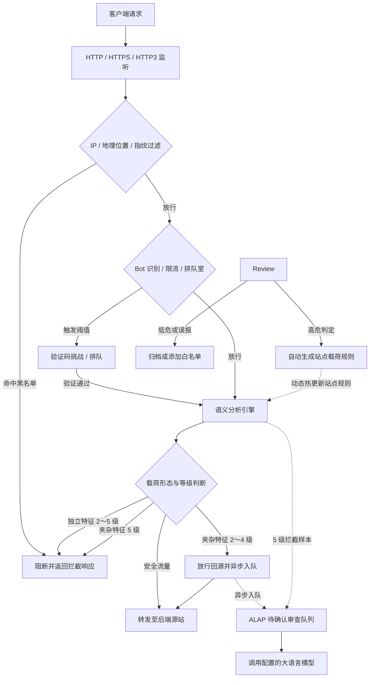

<p align="center">
  
</p>

<h1 align="center">CheeseWAF</h1>

<p align="center"><em>奶酪有洞，AI 来控。</em></p>

<p align="center">
  基于 <strong>ALAP</strong> 机制的智能 Web 应用防火墙<br>
  <strong>自托管 · 轻量化 · 高并发</strong><br>
  数据平面毫秒级阻断，大模型异步后台值守
</p>

<p align="center">
  <a href="README.md">English</a> ·
  <a href="README_CN.md">简体中文</a>
</p>

<p align="center">
  <a href="LICENSE"></a>
  <a href="go.mod"></a>
  <a href="https://github.com/LaokeQwQ/CheeseWAF/releases"></a>
  <a href="https://github.com/LaokeQwQ/CheeseWAF/actions/workflows/ci.yml"></a>
  <a href="https://github.com/LaokeQwQ/CheeseWAF/stargazers"></a>
  <a href="https://github.com/LaokeQwQ/CheeseWAF/issues"></a>
</p>

---

## 目录

- [核心机制](#核心机制)
- [架构与生态](#架构与生态)
- [功能特性](#功能特性)
- [请求处理流程](#请求处理流程)
- [防护等级说明](#防护等级说明)
- [硬件资源建议](#硬件资源建议)
- [部署方式](#部署方式)
  - [1. Linux 部署（Systemd 生产运行）](#1-linux-部署systemd-生产运行)
  - [2. Docker 部署（Docker Compose 容器化）](#2-docker-部署docker-compose-容器化)
  - [3. Windows 部署（单文件 CLI、Zip、NSIS）](#3-windows-部署单文件-clizipnsis)
  - [4. macOS 部署（DMG 与便携包）](#4-macos-部署dmg-与便携包)
- [快速上手](#快速上手)
- [网关接入与适配器](#网关接入与适配器)
- [安全插件与资源包](#安全插件与资源包)
- [管理入口](#管理入口)
- [配置说明](#配置说明)
- [技术栈](#技术栈)
- [生产构建规范](#生产构建规范)
- [开发与测试](#开发与测试)
- [语料治理与安全评估](#语料治理与安全评估)
- [相关文档](#相关文档)
- [开源协议](#开源协议)

---

## 核心机制

传统基于规则库的 WAF 依赖庞大的正则表达式，维护成本高，且容易产生误报或被编码混淆绕过。若对每个请求都调用大模型同步检测，又会给业务代理带来无法接受的网络延迟。

CheeseWAF 采用数据平面与复核平面的双层解耦设计：

1. **实时检测拦截（数据平面）**：内置 AST（抽象语法树）语义分析引擎，在毫秒内完成参数解码与语法结构分析，直接拦截 SQL 注入、XSS 等确定性攻击。
2. **异步深度复核（ALAP 机制）**：**ALAP（AI Large-Language-Model Auto Pilot，大语言模型自动值守）** 在响应正常返回客户端后，将边界模糊或带复杂特征的样本写入后台队列，由大语言模型异步研判，不影响线上业务响应速度。
3. **动态规则沉淀**：站点开启自动采纳后，模型判定为高危（`high` 或 `critical`）的攻击样本会自动生成该站点的长期自定义规则，实时生效并拦截后续流量。全局 IP 阻断与指纹封禁仍保留给运维人员人工确认。

**存储与运行形态**：CheeseWAF 默认采用内置 SQLite 管理状态（`storage.profile: temporary`），开箱即用，免外部数据库依赖；同时支持将访问日志异步投递至外部 PostgreSQL（`storage.postgresql`）以满足集中审计需求。若显式指定 `storage.profile: production`，系统将执行严格的环境校验并遵循 fail-closed 原则抛出 `ErrProductionStorageUnavailable`，确保生产环境的数据隔离与操作安全。

---

## 架构与生态

CheeseWAF 具备清晰的模块边界，由核心检测引擎、网关适配器以及安全插件规范三部分组成：

```text
客户端请求
     │
     ▼
反向代理 / API 网关 (NGINX / Envoy / Kubernetes Ingress)
     │
     ├─ auth_request / ext_authz (HTTP 契约)
     ▼
网关适配器 (CheeseWAF-Adapters / adapterd)
     │
     ├─ X-CheeseWAF-Adapter-Token
     ▼
CheeseWAF 核心服务
  ├─ 数据平面: 毫秒级 AST 语法分析、限流防刷、Bot 挑战
  ├─ 管理平面: Web 控制台、REST API、交互式 CLI (waf-cli)
  ├─ 异步审计: ALAP 大模型后台分析与规则回灌
  ├─ 插件管理: CRP v1 安全资源包离线验签与本地暂存
  └─ 状态存储: 内置 SQLite / 可选 PostgreSQL 日志输出
```

- **核心引擎（CheeseWAF）**：负责实时流量反向代理、语义安全检测、限流防刷、控制台管理与后台异步分析。
- **网关适配器（[CheeseWAF-Adapters](https://github.com/LaokeQwQ/CheeseWAF-Adapters)）**：采用 Go 开发的独立守护进程（`adapterd`），部署在 API 网关或业务旁侧。它将网关协议转换为 CheeseWAF 检查契约，默认以 fail-closed 方式保障网关安全，无需替换既有网关基础设施。
- **安全插件生态（[CheeseSec_Plugin](https://github.com/LaokeQwQ/CheeseSec_Plugin)）**：定义了 CRP v1（CheeseWAF Resources Package）规范。扩展包采用 Ed25519 多重数字签名，具备严格的来源根绑定与防降级版本控制，支持在无网络环境下进行离线验证与安全暂存。

---

## 功能特性

- **AST 语义分析检测**：多层解码结合语法树解析，高效识别 SQL 注入、跨站脚本（XSS）、命令执行等漏洞攻击，摆脱对脆弱正则的依赖。
- **ALAP 异步审查**：后台异步调用兼容标准接口的大模型服务，在不增加代理延迟的前提下持续复核可疑样本。
- **0～5 级防护策略**：细分独立攻击载荷与大段文本夹杂特征，支持配置基于时间窗口的临时防御升档（`promote_seconds`）。
- **访问控制与防刷**：内置 IP 黑白名单、地理位置阻断、客户端软指纹识别、滑动验证码与分片滑动窗口限流。
- **网关解耦适配**：配合 `CheeseWAF-Adapters`，可无缝接入 NGINX、Envoy 和 Kubernetes Ingress 等现有流量入口。
- **安全插件支持**：内置 CRP 规范解析器，支持 Ed25519 签名离线验证与受控目录暂存。
- **多端统一管理**：提供响应式 Web 控制台、终端交互式工具（`waf-cli`）及 RESTful API，三端共享统一鉴权与审计日志。
- **轻量开箱即用**：内置 SQLite 驱动，部署无需外挂数据库；支持将日志流式输出至外部 PostgreSQL。

---

## 请求处理流程

实线表示毫秒级实时数据转发链路，虚线表示响应返回客户端后的 ALAP 异步审查与规则回灌链路：



### 默认网络监听

| 平面 | 默认监听地址 | 说明 |
| :--- | :--- | :--- |
| **数据平面** | `http://127.0.0.1:8080` | 接收 Web 业务流量并执行安全检测与反向代理 |
| **管理平面** | `http://127.0.0.1:9443` | 承载 Web 控制台、REST API 与初始化向导（Docker 默认为 HTTPS） |
| **集群平面** | `https://127.0.0.1:9444` | `cluster.enabled: true` 时启用的可选 TLS/mTLS 节点互联，负责健康检查与节点拓扑发现 |

---

## 防护等级说明

站点防护等级通过参数 `waf.paranoia_level` 配置（合法范围为 **0～5**，默认值为 **3**）。

> **两个彼此独立的配置项：**
> - `waf.paranoia_level`（0～5）决定**语义分析引擎本身**的敏感度，即判定载荷形态的严格程度。
> - `protection_policy.web_attack`（`off` / `low` / `smart` / `high` / `strict`，默认 `smart`）决定**检出攻击后代理层的处置策略**，包括风险评分聚合、告警阈值以及超时失败策略。
> - 在日志元数据中，`waf_policy_decision.paranoia_level` 记录站点敏感度级别（0～5），`waf_policy_decision.policy_tier` 记录处置策略档位（0～4）。两者各司其职，互不混淆。

检测对象为**单个参数解码后的值**（路径与参数名保持可见），检测引擎在语法分析时区分两种载荷形态：
- **独立特征（Isolated）**：输入值几乎全部由攻击载荷构成（例如在搜索框中直接输入 `UNION SELECT 1,2,3`）。
- **夹杂特征（Embedded）**：攻击特征混杂在长篇文章、技术讨论等大段普通文本中（例如在论坛发帖讨论漏洞代码片段）。

### 防护等级行为对照表

| 防护等级 | 等级名称 | 独立特征（Isolated） | 夹杂特征（Embedded） | 动态升档支持 | 机制说明与适用场景 |
| :---: | :--- | :--- | :--- | :---: | :--- |
| **0** | 仅记录 | 记录日志，放行 | 记录日志，放行 | 否 | 业务初次接入时的流量观察期与安全基线测绘。 |
| **1** | 低敏感监控 | 记录日志，放行 | 记录日志，放行 | 否 | 测试环境演练、白名单校验与规则调优。 |
| **2** | 中低防护 | **当场阻断** | **放行回源**，异步复核 | 否 | 包含大量富文本与 UGC 内容的社区，严格控制误报。 |
| **3** | 智能标准（默认） | **当场阻断** | **放行回源**，异步复核 | 否 | 通用 Web 生产环境与企业官网。阻断明确攻击，保障正常业务通行。 |
| **4** | 中高防护 | **当场阻断** | **放行回源**，异步复核 | **支持**（升至 5 级） | 关键业务系统。命中夹杂攻击时可在 `promote_seconds` 窗口内临时升至 5 级。 |
| **5** | 高敏感严格 | **当场阻断** | **当场阻断**，异步复核 | 不适用（已是最高） | 核心支付网关、管理后台，或遭受高频定向攻击期间的紧急防御。 |

> **补充说明：**
> 1. **临时升档（`promote_seconds`）**：在等级 4 下，若检测到夹杂攻击，站点可在指定窗口期内（如 300 秒）临时按等级 5 严格阻断夹杂特征。该截止时间保存在本地存储中，服务重启后依然生效。
> 2. **等级 5 拦截约束**：在等级 5 被阻断的样本依然会进入待确认队列供模型审计（标记为 `blocked`），但不可直接改为放行，支持一键沉淀为长期封禁规则。

---

## 硬件资源建议

初始化向导在初次启动时会运行最长 30 秒的本机环境探测，并给出合理的硬件档位建议。判断依据包括 CPU 逻辑核心数、可见内存及磁盘顺序写入速率：

- **轻量（`low`）**：逻辑核心数不超过 2、内存不超过 2048 MB，或磁盘写入测试未通过。适合 2 核 / 2 GB 的轻量云主机。
- **均衡（`medium`）**：至少 3 个逻辑核心、至少 4096 MB 内存，且磁盘顺序写入正常。
- **强力（`high`）**：至少 4 个逻辑核心、至少 8192 MB 内存，且顺序写入速度达到 50 MB/s 以上。
- **智能自适应（`smart`）**：手动选择的配置档。若环境探测超时或失败，向导会默认推荐 `low` 档位。

档位仅设置预置的防护级别和默认限流阈值，不会向配置文件写入无效的实验性参数。

---

## 部署方式

CheeseWAF 针对主流运维基础设施提供灵活的部署支持。

### 1. Linux 部署（Systemd 生产运行）

适用于各类 Linux 物理机与云服务器，具备极高的执行效率与低资源开销。

#### 步骤 1：下载并解压发行包

生产环境推荐使用带有完整签名的正式发布版本。访问 [Releases](https://github.com/LaokeQwQ/CheeseWAF/releases) 页面下载对应架构的软件包：

稳定版 `vMAJOR.MINOR.PATCH` 采用服务器优先档位，只保证 Linux 发行包。Windows 和 macOS 包只会在分支构建或手动触发的 `full` 档位构建中生成，属于可选操作端包，可能没有平台签名，不属于稳定服务器版的交付保证。

| 发行包名称 | 适用架构 |
| :--- | :--- |
| `cheesewaf-amd64-linux-*.tar.gz` | Linux x86_64 |
| `cheesewaf-arm64-linux-*.tar.gz` | Linux ARM64 |
| `cheesewaf-loong64-linux-*.tar.gz` | Linux 龙芯架构 |

```bash
# 以 Linux x86_64 为例
tar -xzf cheesewaf-amd64-linux-*.tar.gz
cd cheesewaf-*
```

#### 步骤 2：安装程序与静态文件

发行包内包含自动化安装脚本：

```bash
sudo ./install-linux.sh
```

如需手动配置，需同时复制二进制文件与 Web 管理端静态资源：

```bash
sudo install -m 0755 cheesewaf /usr/local/bin/cheesewaf
sudo ln -sf /usr/local/bin/cheesewaf /usr/local/bin/waf-cli
sudo mkdir -p /usr/share/cheesewaf/web /etc/cheesewaf /var/lib/cheesewaf /var/log/cheesewaf
sudo cp -R web/dist/. /usr/share/cheesewaf/web/
# 仅在运行时配置不存在时初始化一次；之后只编辑运行时副本，
# 不要修改版本库中的 configs/cheesewaf.yaml 模板。
if [ ! -e /etc/cheesewaf/cheesewaf.yaml ]; then
  sudo install -m 0640 configs/cheesewaf.yaml /etc/cheesewaf/cheesewaf.yaml
fi
sudo useradd --system --home /var/lib/cheesewaf --shell /usr/sbin/nologin cheesewaf
sudo chown -R cheesewaf:cheesewaf /etc/cheesewaf /var/lib/cheesewaf /var/log/cheesewaf
```

#### 步骤 3：注册 Systemd 服务

将服务单元文件复制到系统目录：

```bash
sudo cp systemd/cheesewaf.service /etc/systemd/system/cheesewaf.service
```

服务配置使用非 root 用户（`cheesewaf`）运行，并声明了 `CAP_NET_BIND_SERVICE` 权限以便安全监听 80 与 443 端口。

#### 步骤 4：启动与管理

```bash
# 重载服务定义并设置开机自启
sudo systemctl daemon-reload
sudo systemctl enable --now cheesewaf

# 检查运行状态
sudo systemctl status cheesewaf
```

管理口默认仅监听 `127.0.0.1:9443`。请在本机或通过 SSH 隧道访问 `http://127.0.0.1:9443/setup`。初始化操作必须携带准入令牌，推荐直接使用运行时生成的 `setup.url` 文件中的完整初始化链接。

---

### 2. Docker 部署（Docker Compose 容器化）

适用于容器化基础设施。支持基于仓库中的 `deploy/docker/Dockerfile` 构建多架构镜像，容器以无特权非 root 用户（UID `10001`）运行，启用只读根文件系统。

#### 步骤 1：准备编排文件

创建 `docker-compose.yml`：

```yaml
services:
  cheesewaf:
    image: cheesewaf:latest
    build:
      context: .
      dockerfile: deploy/docker/Dockerfile
    user: "10001:10001"
    restart: unless-stopped
    read_only: true
    cap_drop:
      - ALL
    security_opt:
      - no-new-privileges:true
    tmpfs:
      - /tmp:size=32m,mode=1777,noexec,nosuid,nodev
    ports:
      - "8080:8080"
      - "127.0.0.1:9443:9443"
    volumes:
      - cheesewaf-data:/var/lib/cheesewaf
      - cheesewaf-logs:/var/log/cheesewaf
    healthcheck:
      test: ["CMD", "/usr/local/bin/cheesewaf-entrypoint", "healthcheck"]
      interval: 30s
      timeout: 5s
      retries: 3

volumes:
  cheesewaf-data:
  cheesewaf-logs:
```

#### 步骤 2：启动容器

```bash
docker compose up -d
docker compose logs -f cheesewaf
```

#### 步骤 3：访问初始化页面

在宿主机浏览器打开 `https://127.0.0.1:9443/setup` 进行初始化配置（容器默认生成自签名证书）。数据卷 `cheesewaf-data` 会持久化所有规则与配置，容器重启或升级不丢失数据。

---

### 3. Windows 部署（单文件 CLI、Zip、NSIS）

Windows 构建适用于本地调试与桌面运维管理。此类包来自分支构建或手动触发的 `full` 档位，不在稳定服务器版发行包中：

- **方式 A：单文件 CLI**：下载 `cheesewaf-amd64-windows-*.exe`，直接在 PowerShell 中执行 `.\cheesewaf.exe setup` 与 `.\cheesewaf.exe serve`。
- **方式 B：便携 ZIP 包**：解压后包含配置文件与本地控制组件，执行 `.\cheesewaf.exe serve --data-dir .\data` 即可运行。
- **方式 C：NSIS 安装器**：运行安装向导，可一键将 CheeseWAF 注册为 Windows 系统服务，并附带托盘控制面板。

---

### 4. macOS 部署（DMG 与便携包）

此类包来自分支构建或手动触发的 `full` 档位，不在稳定服务器版发行包中：

1. 下载适用于当前架构的安装镜像：`cheesewaf-arm64-darwin-*.dmg`（Apple Silicon）或 `cheesewaf-amd64-darwin-*.dmg`（Intel）。
2. 打开镜像并将 **CheeseWAF** 拖入「应用程序」文件夹。
3. 从启动台启动应用，托盘面板支持一键启动、停止服务及快速访问 Web 控制台。
4. 运行数据默认存储在 `~/Library/Application Support/CheeseWAF`。无界面环境亦可直接使用命令行版本。

---

## 快速上手

### 1. 系统初始化

服务启动后，在浏览器中打开初始化地址：
- 从受权限保护的运行时 `setup.url` 文件复制包含令牌的完整链接（如 `http://127.0.0.1:9443/setup#setup_token=...`）。向导会在页面加载后自动通过 Header 发送令牌，并清除地址栏敏感参数。
- 创建超级管理员账号。请牢记设置的密码，系统将基于严格的密码策略保护控制台安全。

### 2. 添加反向代理站点

登录 Web 控制台后，进入 **站点管理** -> **新建站点**：
1. **域名设置**：填写需要防护的业务域名（如 `demo.example.com`）。
2. **上游源站**：配置实际业务服务器的真实 IP 与端口（如 `192.168.1.100:8080`）。
3. **防护策略**：选择适用的防护等级（常规生产业务推荐选择等级 3）。
4. **保存配置**：点击保存后配置将热重载生效，无需重启服务进程。

### 3. 配置大模型接入（ALAP）

进入 **AI 设置** 页面：
1. **接口地址**：填入兼容 OpenAI 或 Anthropic 协议的大模型 Endpoint（如 `https://api.example.com/v1`）。若使用本地自建模型地址，需勾选允许内网地址访问。
2. **认证信息**：填入对应的 API Key 并指定模型名称。
3. **自动采纳**：可在站点配置中单独开启自动采纳开关，高置信度的高危判定将自动转为持久拦截规则。

---

## 网关接入与适配器

如果你的基础设施中已有成熟的反向代理或 API 网关，可以使用 [CheeseWAF-Adapters](https://github.com/LaokeQwQ/CheeseWAF-Adapters) 将流量无缝接入 CheeseWAF 进行安全检测。

### 接入原理

`CheeseWAF-Adapters` 提供轻量级守护进程 `adapterd`，以 sidecar 形式部署在网关旁侧。网关通过标准子请求或外部授权协议（如 NGINX `auth_request`、Envoy `ext_authz`）将请求头与元数据转发给 `adapterd`，再由 `adapterd` 调用 CheeseWAF 核心的 `/api/v1/check` 接口完成判定。

### NGINX 集成示例

启动 `adapterd`：

```bash
adapterd --listen 127.0.0.1:9080 --core-url http://127.0.0.1:8080
```

在 NGINX 配置文件中添加如下指令：

```nginx
location / {
    auth_request /cheesewaf-check;
    proxy_pass http://backend_upstream;
}

location = /cheesewaf-check {
    internal;
    proxy_pass http://127.0.0.1:9080/check;
    proxy_pass_request_body off;
    proxy_set_header Content-Length "";
    proxy_set_header X-Original-URI $request_uri;
    proxy_set_header X-Original-Method $request_method;
    proxy_set_header X-Real-IP $remote_addr;
}
```

### 适配器认证与安全设计

- **令牌认证**：配置环境变量 `CHEESEWAF_ADAPTER_TOKEN` 后，适配器请求必须携带专用的 `X-CheeseWAF-Adapter-Token` 请求头进行鉴权。
- **Fail-Closed 容灾保护**：若 CheeseWAF 核心服务出现网络中断或异常，`adapterd` 默认返回 `503 Service Unavailable`，确保未受保护的流量不会被静默放行。

---

## 安全插件与资源包

CheeseWAF 支持通过 [CheeseSec_Plugin](https://github.com/LaokeQwQ/CheeseSec_Plugin) 分发与加载安全扩展规则。扩展包遵循 CRP v1（CheeseWAF Resources Package）规范，采用标准的 ZIP 打包格式并附带严格的密码学签名。

### CRP v1 规范要点

- **制品结构**：一个合法的 `.crp` 资源包严格包含 `manifest.json`、`signatures/manifest.json` 以及 `artifact/<file>` 三项内容。
- **数字签名**：采用 Ed25519 签名算法，并支持阈值签名规则（如官方发布需满足 2-of-3 签名阈值）。
- **完整性约束**：清单中包含 SHA-256 唯一身份哈希与传输摘要，并声明发布序号（`release_sequence`），杜绝版本回退与重放攻击。

### 命令行工具操作

CheeseWAF CLI 提供针对 CRP 资源包的完整离线验证与受控暂存能力：

```bash
# 1. 离线验证 CRP 资源包签名与来源有效性
cheesewaf crp verify \
  --package ./rules-pack.crp \
  --trust-roots ./trust-roots.json \
  --sources ./sources.json \
  --now 2026-09-06T12:00:00Z

# 2. 验证通过后写入本地受保护的暂存目录（仅保存，不直接激活执行）
cheesewaf crp stage \
  --package ./rules-pack.crp \
  --trust-roots ./trust-roots.json \
  --sources ./sources.json \
  --runtime-dir /var/lib/cheesewaf/crp-runtime \
  --now 2026-09-08T12:00:00Z
```

为防范供应链风险，未通过签名校验或来源未注册的资源包将被核心安全引擎直接拒绝。

---

## 管理入口

CheeseWAF 提供三种平行的管理方式，满足不同场景下的运维需求：

| 入口形式 | 适用场景 | 认证与操作方式 |
| :--- | :--- | :--- |
| **Web 控制台** | 日常监控、规则调整、安全大屏与日志检索 | 浏览器访问，支持响应式布局，具备图形化向导 |
| **终端命令行（CLI）** | 生产脚本、无图形界面服务器、快速排障 | 执行 `waf-cli`，支持子命令与终端全屏交互（TUI） |
| **RESTful API** | CI/CD 自动化编排、企业运维平台集成 | 标准 HTTP 接口，通过 Bearer Token 鉴权，支持完整审计 |

---

## 配置说明

首次启动时，程序将在数据目录生成 `data/config/cheesewaf.yaml`（模板参考 [configs/cheesewaf.yaml](configs/cheesewaf.yaml)）。主要配置结构如下：

```yaml
server:
  listen: "127.0.0.1:8080"       # 数据平面监听地址
  admin_listen: "127.0.0.1:9443" # 管理后台监听地址
  admin_public: false             # 开启公网访问时必须配置 TLS 证书

sites:
  - id: "site-demo"
    name: "示例站点"
    domains: ["demo.example.com"]
    upstreams:
      - address: "192.168.1.100:8080"
        weight: 1
    waf:
      enabled: true
      mode: "block"              # block 拦截 / monitor 仅监控 / off 关闭
      paranoia_level: 3          # 防护等级（0～5）
      semantic_policy:
        auto_agree: true         # 自动采纳高危研判结果
      access_control:
        trusted_cidrs: []        # 受信任的反向代理 CIDR

protection:
  ratelimit:
    enabled: true
    default:
      requests: 100
      window: 60s
      burst: 20
  ip:
    blacklist: []
    whitelist: ["127.0.0.1", "::1"]

ai:
  enabled: true
  provider: "openai"
  api_base: "https://api.example.com/v1"
  model: "provider-default"
```

### 规则批量导入与导出

自定义规则配置于 `sites[].waf.custom_rules` 中。支持通过控制台或命令行进行批量管理：

```bash
# 查看规则模板示例
waf-cli --config ./data/config/cheesewaf.yaml rules example --format yaml

# 导入站点规则（导入前会自动执行校验与去重）
waf-cli --config ./data/config/cheesewaf.yaml rules import --site default --file custom_rules.yaml

# 导出站点当前生效规则
waf-cli --config ./data/config/cheesewaf.yaml rules export --site default --format json
```

服务会自动监听配置文件的修改时间，修改后立即热重载；亦可通过发送 `SIGHUP` 信号触发即时加载。若新规则编译失败，服务将保持原有规则继续工作。

---

## 技术栈

| 模块 | 核心技术选型 |
| :--- | :--- |
| **核心转发** | Go 1.26、`chi` 路由、quic-go（支持 HTTP/3） |
| **检测引擎** | 进程内 AST 语法分析器、客户端软指纹、分片滑动窗口限流 |
| **异步审查** | 内存与持久化任务队列、标准协议转换适配器 |
| **数据存储** | 内置 SQLite 管理存储（免外部服务依赖）；支持外部 PostgreSQL 异步日志输出 |
| **前端架构** | React 18、TypeScript、Vite、Tailwind CSS、shadcn/ui、TanStack Query |
| **终端工具** | Cobra 命令行库、Bubble Tea 终端 UI 框架 |

---

## 生产构建规范

从源码构建生产环境时，前端静态资源统一使用 `bash scripts/ci/build-web.sh` 进行编译。该构建脚本会自动排除本地调试和开发辅助工具，确保最终静态文件纯净安全，并在检测到非生产依赖标识时自动终止构建。

---

## 开发与测试

### 构建环境要求

- Go `1.26` 或更高版本
- Node.js `24.x` 及 npm

### 编译步骤

```bash
# 1. 克隆代码仓库
git clone https://github.com/LaokeQwQ/CheeseWAF.git
cd CheeseWAF

# 2. 构建前端静态资源
bash scripts/ci/build-web.sh

# 3. 编译后端二进制程序
go build -o bin/cheesewaf ./cmd/cheesewaf

# 4. 创建运行时配置副本并启动服务
mkdir -p ./data/config
cp ./configs/cheesewaf.yaml ./data/config/cheesewaf.yaml
./bin/cheesewaf serve --config ./data/config/cheesewaf.yaml --data-dir ./data
```

### 自动化测试与验证

```bash
# 运行后端单元测试
go test -v ./cmd/... ./internal/...
go vet ./cmd/... ./internal/...

# 前端类型检查与组件测试
cd web && npm run typecheck && npm test && cd ..

# 执行本地快速验证检查
bash scripts/acceptance/get-started.sh
```

---

## 语料治理与安全评估

CheeseWAF 配套了受治理的安全语料评测体系。语料处理流程严格遵循：全局去重 → 结构初筛 → 语义挑选清洗 → 二次交叉复核。

```bash
# 审计当前可用语料并生成统计报告
make corpus-governance

# 构建具备哈希绑定的正式评测快照并执行回归评估
make security-corpus
```

CI 自动化验证要求正式快照包含至少 250 条良性请求与 10,000 条攻击样本，且必须达到**误报率 FPR < 0.8%**、**召回率 TPR ≥ 99%** 的基线指标，方可允许合入。

---

## 相关文档

- [ACME 证书自动化与重载方案](docs/acme.md)
- [防护策略技术规范](docs/protection-policy-roadmap.md)
- [语料治理与检测评估实施规范](docs/semantic-corpus-governance.md)
- [防护等级代码映射说明](docs/paranoia-level-implementation.md)
- [性能优化与基准测试指南](docs/performance-optimization.md)
- [Windows 打包与服务部署说明](deploy/windows/README.md)

---

## 开源协议

本项目基于 [Apache License 2.0](LICENSE) 许可证开放源代码。
