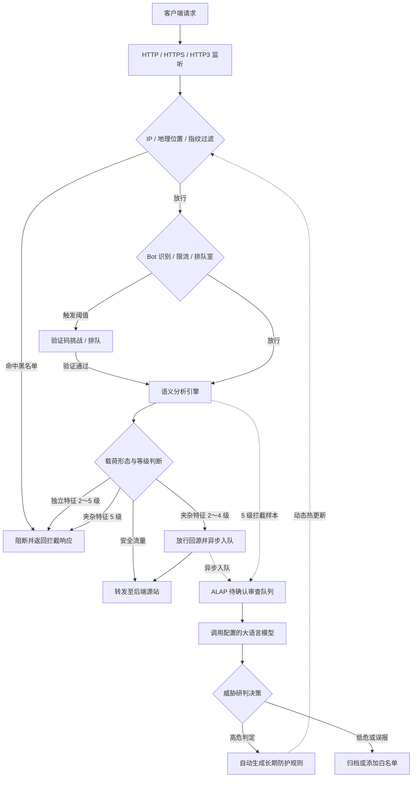

<p align="center">
  
</p>

<h1 align="center">CheeseWAF</h1>

<p align="center"><em>奶酪有洞，AI 来控。</em></p>

<p align="center">
  一款基于 <strong>ALAP</strong> 的智能 WAF<br>
  <strong>自托管 + 轻量化 + 高并发</strong><br>
  让 AI 来接手把关，把时间花在真正需要的地方
</p>

<p align="center">
  <a href="README.md">English</a> ·
  <a href="README_CN.md">简体中文</a>
</p>

<p align="center">
  <a href="LICENSE"></a>
  <a href="go.mod"></a>
  <a href="https://github.com/LaokeQwQ/CheeseWAF/releases"></a>
  <a href="https://github.com/LaokeQwQ/CheeseWAF/actions/workflows/ci.yml"></a>
  <a href="https://github.com/LaokeQwQ/CheeseWAF/stargazers"></a>
  <a href="https://github.com/LaokeQwQ/CheeseWAF/issues"></a>
</p>

---

## 目录

- [核心机制](#核心机制)
- [功能列表](#功能列表)
- [流量处理流程](#流量处理流程)
- [防护等级说明](#防护等级说明)
- [部署方式](#部署方式)
  - [1. Linux 部署（Systemd 生产运行）](#1-linux-部署systemd-生产运行)
  - [2. Docker 部署（Docker Compose 容器化）](#2-docker-部署docker-compose-容器化)
  - [3. Windows 部署（单文件 CLI、Zip、NSIS）](#3-windows-部署单文件-clizipnsis)
  - [4. macOS 部署（DMG）](#4-macos-部署dmg)
- [快速上手](#快速上手)
- [管理入口](#管理入口)
- [配置说明](#配置说明)
- [技术栈](#技术栈)
- [开发与测试](#开发与测试)
- [相关文档](#相关文档)
- [开源协议](#开源协议)

---

## 核心机制

传统基于规则的 WAF 依赖庞大的正则表达式库，维护成本高且容易产生误报或被编码混淆绕过；若将每个请求同步发送给大语言模型分析，又会引入无法接受的网络延迟。

CheeseWAF 采用分层处理方案：

1. **实时拦截（数据平面）**：内置语义分析引擎在毫秒级对输入参数完成多层解码与抽象语法树（AST）语法分析，对确定性攻击实施即时拦截。
2. **异步复核（ALAP 机制）**：**ALAP（AI Large-Language-Model Auto Pilot，大语言模型自动领航）** 在请求响应返回客户端后，将可疑、边界模糊或带有攻击特征的样本放入后台队列，由大语言模型异步深度审查，全程自动值守，不占用业务转发延迟。
3. **动态规则生成**：大模型复核判定为高危（`high` 或 `critical`）的样本，在开启自动同意后可自动沉淀为长期的 IP、客户端指纹或特征规则，反哺数据平面进行拦截。

系统以单个静态二进制程序交付，内置响应式 Web 控制台、命令行 TUI 工具与 RESTful 管理 API，无需安装外部复杂中间件即可独立运行。

---

## 功能列表

- **语义分析检测**：通过多阶段解码与语法树评估识别 SQL 注入、XSS、命令执行等攻击，不依赖庞大且脆弱的正则表达式。
- **ALAP 异步审查**：支持对接任意兼容 OpenAI 协议的大模型接口或私有模型，后台异步运行，不阻塞线上请求。
- **0～5 级防护策略**：支持针对站点分别配置防护级别，区分独立攻击载荷与长文本中夹杂的特征，支持基于时间的临时升档（`promote_seconds`）。
- **访问控制与防刷**：内置 IP 黑白名单、地理位置封禁、客户端软指纹识别、滑动验证码挑战、令牌桶限流与排队等待室。
- **三端统一管理**：Web 控制台（桌面与移动端自适应）、终端交互工具（`waf-cli`）与 RESTful API 共享同一套权限体系、会话管理与审计日志。
- **轻量独立交付**：纯 Go 语言编写，内置 SQLite 存储（无 CGO 依赖），支持单机运行与容器化编排。

---

## 流量处理流程

实线表示毫秒级实时数据转发链路，虚线表示响应返回客户端后的 ALAP 异步审查与规则回灌链路：



### 默认网络监听

| 平面 | 默认监听地址 | 说明 |
| :--- | :--- | :--- |
| **数据平面** | `http://127.0.0.1:8080` | 接收 Web 业务流量并执行安全检测与反向代理 |
| **管理平面** | `http://127.0.0.1:9443` | 承载 Web 控制台、REST API 与初始化向导（Docker 默认为 HTTPS） |
| **集群平面** | `http://127.0.0.1:9444` | 多节点集群模式下的状态同步与节点通信 |

---

## 防护等级说明

站点防护等级通过参数 `waf.paranoia_level` 配置（合法范围为 **0～5**，默认值为 **3**）。

检测对象为**单个参数解码后的值**（路径与参数名保持可见），检测引擎在语法分析时区分两种载荷形态：
- **独立特征（Isolated）**：输入值几乎全部由攻击载荷构成（允许 `@`、结尾分号、`/{${...}}` 等微弱包装）。例如搜索框中直接输入 `UNION SELECT 1,2,3`。
- **夹杂特征（Embedded）**：攻击特征混杂在长篇文章、正常业务说明或技术讨论等大段普通文本中。例如在技术论坛中发帖讨论代码片段。

**隔离分类当前范围：**
- 隔离 gadget 列表覆盖 **PHP/JSP 活 shell**、**Log4j JNDI** 查找，以及**短引号/谓词 SQL**（≤96 个 rune）。
- **XSS**、命令/RCE、**SSTI**、**SSRF**、**XXE** 走文档形态守卫，不在该 gadget 列表内。
- 仅标记为 **embedded（夹杂）** 的命中在防护等级低于 5 时跳过阻断。
- **未分类** 命中仍走 `blockableHit` 证据规则，**不会**自动按夹杂处理。
- 不承诺「所有技术文章一定放行」——隔离降低已覆盖 gadget 的误报，不是全文通行证。

### 防护等级行为对照表

| 防护等级 | 等级名称 | 独立特征（Isolated） | 夹杂特征（Embedded） | 动态升档支持 | 机制说明与适用场景 |
| :---: | :--- | :--- | :--- | :---: | :--- |
| **0** | 仅记录 | 记录日志，放行 | 记录日志，放行 | 否 | 业务初次接入时的流量观察期与基线测绘。 |
| **1** | 低敏感监控 | 记录日志，放行 | 记录日志，放行 | 否 | 测试环境联调演练、白名单校验与规则调优。 |
| **2** | 中低防护 | **当场阻断** | **放行回源**，异步复核 | 否 | 包含大量富文本编辑、UGC 内容的社区与博客，严格控制误报。 |
| **3** | 智能标准（默认） | **当场阻断** | **放行回源**，异步复核 | 否 | 通用 Web 生产环境与企业官网。阻断明确攻击，保障正常业务通行。 |
| **4** | 中高防护 | **当场阻断** | **放行回源**，异步复核 | **支持**（升至 5 级） | 关键业务系统。命中夹杂攻击时可在 `promote_seconds` 窗口内临时升至 5 级。 |
| **5** | 高敏感严格 | **当场阻断** | **当场阻断**，异步复核 | 不适用（已是最高） | 核心支付网关、管理后台，或遭受高频定向攻击期间的紧急防御。 |

> **补充说明：**
> 1. **临时升档（`promote_seconds`）**：在等级 4 下，若检测到夹杂攻击，站点可在指定窗口期内（如 300 秒）临时按等级 5 严格阻断夹杂特征。升档截止时间持久化在 SQLite 中，服务重启依然生效。
> 2. **等级 5 拦截约束**：在等级 5 被阻断的样本依然会进入待确认队列供模型审计（标记为 `blocked`），但不可直接改为放行，仅支持一键沉淀为长期封禁规则（同类特征、URL、IP、客户端指纹）。

---

## 部署方式

CheeseWAF 针对不同基础设施环境提供三种独立的部署方式。

### 1. Linux 部署（Systemd 生产运行）

适用于各类 Linux 物理服务器与虚拟机，具备高性能与低资源开销。

#### 步骤 1：下载并解压发行包

从 [Releases](https://github.com/LaokeQwQ/CheeseWAF/releases) 下载 **Alpha-** 预发布包，或从 Actions 产物里取同一套文件。按系统和 CPU 选：

| 文件 | 平台 |
| --- | --- |
| `cheesewaf-amd64-linux-*-PreTest.tar.gz` | Linux x86_64 |
| `cheesewaf-arm64-linux-*-PreTest.tar.gz` | Linux ARM64 |
| `cheesewaf-loong64-linux-*-PreTest.tar.gz` | Linux 龙芯 |
| `cheesewaf-amd64-darwin-*-PreTest.tar.gz` / `.dmg` | macOS Intel |
| `cheesewaf-arm64-darwin-*-PreTest.tar.gz` / `.dmg` | macOS Apple Silicon |
| `cheesewaf-amd64-windows-*-PreTest.exe` | Windows x86_64 单文件 CLI |
| `cheesewaf-arm64-windows-*-PreTest.exe` | Windows ARM64 单文件 CLI |
| `cheesewaf-amd64-windows-*-PreTest.zip` | Windows x86_64 便携目录 |
| `cheesewaf-arm64-windows-*-PreTest.zip` | Windows ARM64 便携目录 |

```bash
# Linux x86_64 示例
tar -xzf cheesewaf-amd64-linux-*-PreTest.tar.gz
cd cheesewaf-*
```

Linux ARM64、龙芯用 `cheesewaf-arm64-linux-*-PreTest.tar.gz` 或 `cheesewaf-loong64-linux-*-PreTest.tar.gz`，步骤相同。

#### 步骤 2：安装程序文件与目录授权

```bash
# 安装可执行文件并建立软链接
sudo install -m 0755 cheesewaf /usr/local/bin/cheesewaf
sudo ln -sf /usr/local/bin/cheesewaf /usr/local/bin/waf-cli

# 创建配置与数据存储目录
sudo mkdir -p /etc/cheesewaf /var/lib/cheesewaf /var/log/cheesewaf
sudo cp configs/cheesewaf.yaml /etc/cheesewaf/cheesewaf.yaml

# 创建系统运行用户并分配权限
sudo useradd --system --home /var/lib/cheesewaf --shell /usr/sbin/nologin cheesewaf
sudo chown -R cheesewaf:cheesewaf /etc/cheesewaf /var/lib/cheesewaf /var/log/cheesewaf
```

#### 步骤 3：配置 Systemd 服务

Linux 包里带有 `systemd/cheesewaf.service`。拷到系统目录即可：

```bash
sudo cp systemd/cheesewaf.service /etc/systemd/system/cheesewaf.service
```

#### 步骤 4：启动与状态检查

```bash
# 重新加载服务定义并设置开机自启
sudo systemctl daemon-reload
sudo systemctl enable --now cheesewaf

# 检查服务运行状态
sudo systemctl status cheesewaf
```

启动完成后，通过浏览器访问 `http://<服务器IP>:9443/setup` 进行初始化。

---

### 2. Docker 部署（Docker Compose 容器化）

适用于容器化基础设施与快速测试。`docker compose build` 会按宿主机 CPU 编出 `linux/amd64` 或 `linux/arm64`。容器以非 root 用户（UID `10001`）运行，根文件系统只读。

#### 步骤 1：准备编排文件

创建 `docker-compose.yml`：

```yaml
services:
  cheesewaf:
    image: cheesewaf:latest
    build:
      context: .
      dockerfile: deploy/docker/Dockerfile
    user: "10001:10001"
    restart: unless-stopped
    read_only: true
    cap_drop:
      - ALL
    security_opt:
      - no-new-privileges:true
    tmpfs:
      - /tmp:size=32m,mode=1777,noexec,nosuid,nodev
    ports:
      - "8080:8080"
      - "9443:9443"
    volumes:
      - cheesewaf-data:/var/lib/cheesewaf
      - cheesewaf-logs:/var/log/cheesewaf
    healthcheck:
      test: ["CMD", "/usr/local/bin/cheesewaf-entrypoint", "healthcheck"]
      interval: 30s
      timeout: 5s
      retries: 3

volumes:
  cheesewaf-data:
  cheesewaf-logs:
```

#### 步骤 2：启动容器

```bash
# 启动服务
docker compose up -d

# 查看运行日志与初始 Token
docker compose logs -f cheesewaf
```

#### 步骤 3：访问管理端

- 访问 `https://<宿主机IP>:9443/setup` 进行初始化设置（容器环境默认使用自签名证书）。
- 首次初始化所需的令牌可在启动日志中获取。
- 业务数据保存在 `cheesewaf-data` 卷中，执行 `docker compose down` 不会丢失配置数据。

---

### 3. Windows 部署（单文件 CLI、Zip、NSIS）

三种形态：单文件 CLI 就是一个 `cheesewaf.exe`；zip 另带配置、管理界面和本地控制器；NSIS 是图形安装器。

#### 方式 A：单文件 CLI

1. 下载 `cheesewaf-*-windows-amd64.exe` 或 `cheesewaf-*-windows-arm64.exe`。
2. 直接运行：

```powershell
.\cheesewaf-*-windows-amd64.exe serve --config .\cheesewaf.yaml --data-dir .\data
.\cheesewaf-*-windows-amd64.exe status
.\cheesewaf-*-windows-amd64.exe stop
```

转发面不依赖安装器。管理界面在 zip / DMG / tar 包里，放在可执行文件旁边的 `web/dist`。

#### 方式 B：便携目录（Zip）

1. 下载 `cheesewaf-*-windows-amd64.zip` 或 `cheesewaf-*-windows-arm64.zip`，解压到目标目录（如 `D:\CheeseWAF`）。
2. 运行：

```powershell
.\cheesewaf.exe serve --config .\configs\cheesewaf.yaml --data-dir .\data
.\cheesewaf.exe status
.\cheesewaf.exe stop
```

#### 方式 C：NSIS 图形安装器

1. 运行 `CheeseWAF-*-windows-amd64-setup.exe` 或 `CheeseWAF-*-windows-arm64-setup.exe`。
2. 按向导安装。
3. 卸载时默认保留 `data\`。

#### 本地控制器（`cheesewaf-gui`）

Windows 发行包中包含专用的本地控制器，仅监听本地回环地址（`127.0.0.1:17943`）：
- 提供图形界面启动、停止与重启后台 WAF 进程。
- 实时显示进程 PID 与运行状态。
- 提供一键打开 Web 控制台与配置文件夹的快捷入口。
- 支持配置当前用户登录时自动启动。

---

### 4. macOS 部署（DMG）

1. 下载 `cheesewaf-arm64-darwin-*-PreTest.dmg`（Apple Silicon）或 `cheesewaf-amd64-darwin-*-PreTest.dmg`（Intel）。
2. 打开镜像，把 **CheeseWAF** 拖进「应用程序」。
3. 从启动台或「应用程序」打开 CheeseWAF。会启动本地控制面板，用来启动、停止和打开 Web 控制台。
4. 若系统提示已损坏，是拦截了未公证的 PreTest 包。双击盘里的 **Fix Gatekeeper.command**，或在终端执行：

```bash
xattr -dr com.apple.quarantine /Applications/CheeseWAF.app
open /Applications/CheeseWAF.app
```

运行数据在 `~/Library/Application Support/CheeseWAF`。如果只要命令行，也可以继续用 `cheesewaf-*-darwin-*-PreTest.tar.gz`。

---

## 快速上手

### 1. 初始化系统

服务启动后，在浏览器中打开初始化地址：
- 访问 `http://127.0.0.1:9443/setup`（Docker 环境为 `https://127.0.0.1:9443/setup`）。
- 创建超级管理员账号，并妥善保存系统生成的密钥凭据。

### 2. 添加反向代理站点

在控制台中进入 **站点管理** -> **新建站点**：
1. **域名设置**：输入站点的外部访问域名（如 `example.com`）。
2. **上游源站**：配置实际业务服务器的 IP 和端口（如 `10.0.0.10:8000`）。
3. **防护策略**：选择防护等级（常规业务推荐选择等级 3）。
4. **提交生效**：点击保存后配置热重载生效，无需重启服务。

### 3. 配置大模型接入（ALAP）

在控制台中进入 **AI 设置**：
1. **接口地址**：填写大模型服务的 API Endpoint（如 `https://api.openai.com/v1`）。
2. **认证信息**：填入 API Key 并指定模型名称。
3. **自动采纳**：开启后，大模型判定为高危的样本将自动生成拦截规则。

---

## 管理入口

CheeseWAF 提供三种互通的管理方式：

| 入口形式 | 适用场景 | 说明 |
| :--- | :--- | :--- |
| **Web 控制台** | 日常运营、规则配置、日志与大屏 | 响应式设计，支持桌面与移动端浏览器访问 |
| **终端命令行（CLI）** | 运维排障、脚本调用、无图形界面服务器 | 执行 `waf-cli`，支持命令行子命令与 TUI 交互界面 |
| **RESTful API** | CI/CD 流程、自动化运维系统集成 | 标准 HTTP 接口，使用 Bearer Token 认证 |

---

## 配置说明

首次启动时，程序将在数据目录生成 `cheesewaf.yaml`（模板参见 [configs/cheesewaf.yaml](configs/cheesewaf.yaml)）。核心配置结构如下：

```yaml
server:
  listen: "0.0.0.0:8080"         # 业务转发流量监听地址
  admin_listen: "127.0.0.1:9443"   # 管理后台监听地址
  admin_public: false            # 是否对公网开放管理端（开启需同时配置 TLS）

sites:
  - id: "site-demo"
    name: "示例站点"
    domains: ["demo.example.com"]
    upstreams:
      - address: "192.168.1.100:8080"
        weight: 1
    waf:
      paranoia_level: 3          # 防护等级（0～5）

protection:
  rate_limit:
    enabled: true
    requests_per_second: 100
  ip_block:
    enabled: true

ai:
  enabled: true
  provider: "openai"
  endpoint: "https://api.example.com/v1"
  model: "gpt-4o-mini"
  auto_agree: true               # 自动采纳高危研判结果
```

---

## 技术栈

| 模块 | 选型 |
| :--- | :--- |
| **核心转发** | Go 1.26、`chi` 路由、quic-go（支持 HTTP/3） |
| **检测引擎** | 进程内 AST 语法分析器、客户端软指纹、令牌桶限流算法 |
| **异步审查** | 内存与持久化队列、标准 Chat Completions / Messages 协议适配 |
| **数据存储** | 内嵌 SQLite（`modernc.org/sqlite`，纯 Go 实现）、支持对接 PostgreSQL |
| **前端架构** | React 18、TypeScript、Vite、Tailwind CSS、shadcn/ui、TanStack Query |
| **终端工具** | Cobra 命令行库、Bubble Tea 终端 UI 框架 |

---

## 开发与测试

### 构建环境

- Go `1.26` 及以上
- Node.js `24.x` 及 npm

### 编译步骤

```bash
# 1. 克隆代码仓库
git clone https://github.com/LaokeQwQ/CheeseWAF.git
cd CheeseWAF

# 2. 构建前端静态资源
cd web
npm ci
npm run build
cd ..

# 3. 构建后端二进制
go build -o bin/cheesewaf ./cmd/cheesewaf

# 4. 运行
./bin/cheesewaf serve --config ./configs/cheesewaf.yaml
```

### 测试与语料验证

```bash
# 后端单元测试
go test -v ./cmd/... ./internal/...
go vet ./cmd/... ./internal/...

# 前端类型检查与单元测试
cd web && npm run typecheck && npm test && cd ..

# 运行内置安全攻击语料测试
go run ./cmd/cheesewaf-corpus --mode analyzer
```

---

## 相关文档

- [防护策略与技术路线](docs/protection-policy-roadmap.md)
- [防护等级代码实现映射](docs/paranoia-level-implementation.md)
- [性能优化与基准测试](docs/performance-optimization.md)
- [Windows 打包说明](deploy/windows/README.md)

---

## 开源协议

本项目采用 [Apache License 2.0](LICENSE) 许可证开放源代码。
