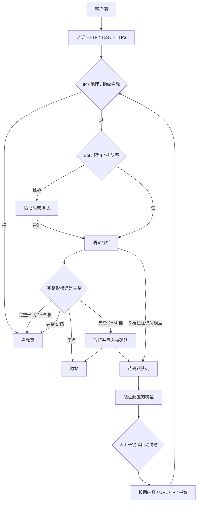

<p align="center">
  
</p>

<h1 align="center">CheeseWAF</h1>

<p align="center"><em>奶酪有洞，AI 来控。</em></p>

<p align="center">
  自托管 Web 应用防火墙。一个程序，带 WEB、控制面板和 CLI。
</p>

<p align="center">
  <a href="README.md">English</a> ·
  <a href="README_CN.md">简体中文</a>
</p>

<p align="center">
  <a href="LICENSE">Apache-2.0</a>
</p>

<p align="center">
  <a href="https://github.com/LaokeQwQ/CheeseWAF/stargazers"></a>
  <a href="https://github.com/LaokeQwQ/CheeseWAF/network/members"></a>
  <a href="https://github.com/LaokeQwQ/CheeseWAF/watchers"></a>
  <a href="https://github.com/LaokeQwQ/CheeseWAF/issues"></a>
  <a href="https://github.com/LaokeQwQ/CheeseWAF/pulls"></a>
  <a href="LICENSE"></a>
  <br>
  <a href="go.mod"></a>
  <a href="https://github.com/LaokeQwQ/CheeseWAF/releases"></a>
  <a href="https://github.com/LaokeQwQ/CheeseWAF/commits"></a>
  <a href="https://github.com/LaokeQwQ/CheeseWAF/actions/workflows/ci.yml"></a>
  
  
  
</p>

> 项目还没正式对外。配置和接口以后可能改。

## Menu

- [什么是 ALAP](#什么是-alap)
- [WEB + 控制面板 + CLI](#web--控制面板--cli)
- [流量路径](#流量路径)
- [防护等级](#防护等级)
- [安装](#安装)
- [配置](#配置)
- [技术栈](#技术栈)
- [开发](#开发)
- [文档](#文档)
- [许可证](#许可证)

## 什么是 ALAP

CheeseWAF 把自己叫 **ALAP** 型 WAF。

**ALAP** 是 **AI Large-Language-Model Auto Pilot** 的缩写，中文是「大语言模型自动驾驶」。

| 部分 | 原文 | 意思 |
| --- | --- | --- |
| AI Large-Language-Model | 大语言模型 | 你在站点里配置的对话接口 |
| Auto Pilot | 自动驾驶 | 后台写结论，并可按开关自动转成长期规则 |

请求先走语义引擎，当场决定拦还是放。模型在后面看待确认，不挡住这次访问。接口地址你自己填，文档里不指定哪家。

### 为什么要这样

只靠规则命中，夹在文章里的同样字节很容易误杀。所以 CheeseWAF 先看形状，再决定要不要问模型。

1. 引擎看的是单个参数解码后的值，不是整段 HTTP。
2. 字段里几乎只有攻击内容（完整形状）时，2 档及以上会拦。允许很薄的包装，比如 `@`、末尾 `;`、`/{${...}}`。
3. 同样内容夹在正常文字里，2～4 档放行，并写入待确认；只有 5 档当场拦。
4. 5 档拦住之后，仍会把条目交给模型看。管理员还可以补长期规则：同类内容、URL、IP、指纹。已经拦住的条目不能改成放行。
5. 打开自动同意，且模型判定风险高时，会写成长期拦截。

## WEB + 控制面板 + CLI

管理接口只有一套。外面三个入口：

| 入口 | 做什么 |
| --- | --- |
| **WEB** | 用浏览器打开。电脑和手机是同一套页面。 |
| **控制面板** | 改站点、规则、待确认、日志、地图、集群。 |
| **CLI** | 发行包里的 `waf-cli`，实际调用 `cheesewaf cli`。 |

账号权限、会话和审计是共用的。

## 流量路径

实线是这次请求。虚线是事后处理，响应已经返回了。



本机默认地址：

| 用途 | 地址 |
| --- | --- |
| 转发流量 | `http://127.0.0.1:8080` |
| 管理初始化 | `http://127.0.0.1:9443/setup`。Docker 里一般是 `https://127.0.0.1:9443/setup` |

## 防护等级

站点字段是 `waf.paranoia_level`。新站默认 **3**。YAML 里不写也按 3。写明 `0` 就只记不拦。

| 档 | 完整形状 | 夹在文章里 |
| --- | --- | --- |
| 0～1 | 只记 | 只记 |
| 2～4 | 当场拦 | 放行，问模型，进待确认 |
| 5 | 当场拦 | 当场拦，仍问模型 |

4 档碰到夹杂后，可以设 `promote_seconds`，短时间按 5 档拦。时间写在 SQLite 里，重启还在。

指纹是 `User-Agent` 加 `Accept-Language` 做 SHA-256，取前 8 字节，写成 16 位十六进制。不是 JA3。

更细的规则见 [docs/protection-policy-roadmap.md](docs/protection-policy-roadmap.md)。

## 安装

推荐顺序：先用发行包加 systemd，需要整套实例时再用 Compose，多机用控制台生成的 Ansible 剧本。

### 1. 发行包和 systemd（推荐）

推到 `dev`、`canary`、`master` 后，CI 会打出：

`cheesewaf-<version>-<os>-<arch>.tar.gz`

解开后是一个目录，里面有 `cheesewaf`、`waf-cli`、`web/dist`、示例配置和 `VERSION`。

```bash
tar -xzf cheesewaf-*-linux-amd64.tar.gz
cd cheesewaf-*

sudo install -m 0755 cheesewaf /usr/local/bin/cheesewaf
sudo ln -sf /usr/local/bin/cheesewaf /usr/local/bin/waf-cli

sudo mkdir -p /etc/cheesewaf /var/lib/cheesewaf /var/log/cheesewaf
sudo cp configs/cheesewaf.yaml /etc/cheesewaf/cheesewaf.yaml
sudo cp deploy/systemd/cheesewaf.service /etc/systemd/system/cheesewaf.service

sudo useradd --system --home /var/lib/cheesewaf --shell /usr/sbin/nologin cheesewaf
sudo chown -R cheesewaf:cheesewaf /etc/cheesewaf /var/lib/cheesewaf /var/log/cheesewaf

sudo systemctl daemon-reload
sudo systemctl enable --now cheesewaf
```

单元文件在 [deploy/systemd/cheesewaf.service](deploy/systemd/cheesewaf.service)。启动命令是：

```text
/usr/local/bin/cheesewaf serve --config /etc/cheesewaf/cheesewaf.yaml
```

发行包里不一定带这份 unit。可以从仓库拷，也可以按上面的命令自己写。

然后打开初始化页，建管理员，把示例站点的上游改成你的源站。

Windows 用 zip（`cheesewaf.exe serve`）或 NSIS 安装包。

### 2. Docker Compose（备选）

适合先拉起一套完整环境，不是默认的上线方式。

```bash
git clone https://github.com/LaokeQwQ/CheeseWAF.git
cd CheeseWAF
docker compose -f deploy/docker/docker-compose.yml up -d --build
docker compose -f deploy/docker/docker-compose.yml logs -f cheesewaf
```

打开 `https://127.0.0.1:9443/setup`。容器用自签名证书。第一次的令牌只写在启动日志里。

```bash
docker compose -f deploy/docker/docker-compose.yml down
```

数据在 Compose 卷里。`down` 不会删卷。

### 3. 多机 Ansible

仓库里没有现成的 `deploy/ansible/`。在管理面按集群计划生成剧本：

`POST /api/cluster/deploy/ansible`

包里有 `inventory.ini`、`playbook.yml`、systemd 角色和配置模板。不含 SSH 密码和加入令牌。SSH 用你自己的 inventory 或 agent。

```bash
ansible-playbook -i inventory.ini playbook.yml
```

生成的剧本里，两台 WAF 是分担流量，不是完整高可用。

### 从源码运行（开发）

需要 **Go 1.26.6** 和 **Node.js 24.18.0**。

```bash
git clone https://github.com/LaokeQwQ/CheeseWAF.git
cd CheeseWAF
cd web && npm ci && npm run build && cd ..
go run ./cmd/cheesewaf serve
```

## 配置

第一次启动会写出 `data/cheesewaf.yaml`。例子在 [configs/cheesewaf.yaml](configs/cheesewaf.yaml)。

| 段 | 用途 |
| --- | --- |
| `server` | 转发口和管理口的地址、TLS |
| `sites` | 域名、源站、检测策略、白名单、重写 |
| `protection` | 全局等级、IP、限流、Bot、API 安全 |
| `storage` / `logging` / `monitor` | 数据库、日志、指标和告警 |
| `ai` | 站点模型。待确认、自动同意和控制台助手都用它 |

管理口默认只听 `127.0.0.1`。要对外开，需要同时打开 `server.admin_public` 和管理 TLS。

## 技术栈

| 层 | 用什么 |
| --- | --- |
| 转发和检测 | Go 1.26、`chi`、YAML v3、quic-go（HTTP/3）、进程内语义分析 |
| 模型调用 | 站点自己配的对话接口（completions 或 messages），后台排队 |
| 存储 | 默认 SQLite（`modernc.org/sqlite`），日志可以接到 PostgreSQL 等 |
| 管理接口 | 同一个程序，Bearer 会话，按角色授权 |
| WEB / 控制面板 | React 18、TypeScript、Vite、Tailwind、shadcn/Radix、TanStack Query |
| CLI | Cobra、Bubble Tea（`waf-cli`） |
| 安装 | 单个静态文件、systemd、Docker、Windows zip / NSIS、生成 Ansible 剧本 |

## 开发

```bash
go test ./cmd/... ./internal/...
go vet ./cmd/... ./internal/...

cd web
npm ci
npm run typecheck
npm test
npm run build
```

回放内置样本：

```bash
go run ./cmd/cheesewaf-corpus --mode analyzer
go run ./cmd/cheesewaf-corpus --mode http --base-url http://127.0.0.1:8080
```

合入顺序：`feature/*` → `dev` → `canary` → `master`。必过检查通过后再合。

## 文档

| 文档 | 内容 |
| --- | --- |
| [docs/protection-policy-roadmap.md](docs/protection-policy-roadmap.md) | 0～5 档、待确认、不做的事 |
| [docs/paranoia-level-implementation.md](docs/paranoia-level-implementation.md) | 档位怎么接到代码 |
| [docs/performance-optimization.md](docs/performance-optimization.md) | 运行时和分析器 |

## 许可证

[Apache License 2.0](LICENSE)。
