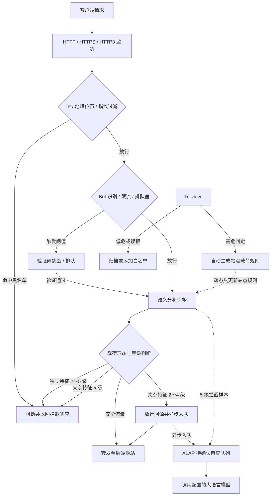

<p align="center">
  
</p>

<h1 align="center">CheeseWAF</h1>

<p align="center"><em>奶酪有洞，AI 来控。</em></p>

<p align="center">
  基于 <strong>ALAP</strong> 机制的智能 Web 应用防火墙<br>
  <strong>自托管 · 轻量化 · 高并发</strong><br>
  数据平面毫秒级阻断，大模型异步后台值守
</p>

<p align="center">
  <a href="README.md">English</a> ·
  <a href="README_CN.md">简体中文</a>
</p>

<p align="center">
  <a href="LICENSE"></a>
  <a href="go.mod"></a>
  <a href="https://github.com/LaokeQwQ/CheeseWAF/releases"></a>
  <a href="https://github.com/LaokeQwQ/CheeseWAF/actions/workflows/ci.yml"></a>
  <a href="https://github.com/LaokeQwQ/CheeseWAF/stargazers"></a>
  <a href="https://github.com/LaokeQwQ/CheeseWAF/issues"></a>
</p>

---

<p align="center">
  <a href="#为什么选择-cheesewaf">⚡ 为什么选择 CheeseWAF</a> ·
  <a href="#快速上手">🚀 快速上手</a> ·
  <a href="#部署方式">📦 部署指南</a> ·
  <a href="#网关接入与适配器">🔌 网关接入</a> ·
  <a href="#配置说明">⚙️ 配置参考</a>
</p>

<details>
<summary><strong>📑 展开完整目录导航</strong></summary>

- **方案选型**：[为什么选择 CheeseWAF](#为什么选择-cheesewaf) · [核心机制 (ALAP)](#核心机制) · [架构与生态](#架构与生态) · [功能特性](#功能特性) · [请求处理流程](#请求处理流程)
- **安装运行**：[硬件推荐](#硬件档位推荐) · [快速上手](#快速上手) · [Linux Systemd](#1-linux-部署systemd-生产运行) · [Docker Compose](#2-docker-部署docker-compose-容器化) · [Windows](#3-windows-部署单文件-clizipnsis) · [macOS](#4-macos-部署dmg-与便携包)
- **网关与插件**：[防护等级 (0～5)](#防护等级说明) · [网关适配器 (adapterd)](#网关接入与适配器) · [CRP 离线安全插件](#安全插件与资源包) · [管理入口 (Web/CLI/API)](#管理入口)
- **配置与维护**：[配置说明](#配置说明) · [技术栈](#技术栈) · [生产构建](#生产构建规范) · [开发与测试](#开发与测试) · [语料治理](#语料治理与安全评估) · [相关文档](#相关文档)

</details>

---

## 为什么选择 CheeseWAF

市面上常见的 Web 安全防护方案通常面临几个痛点：
1. **传统正则 WAF（如 ModSecurity / CRS 规则集）**：靠维护成千上万条正则表达式防守。攻击者通过大小写变异、畸形 URL 编码或特殊注释很容易绕过；同时误报率高，日常运维需要大量写白名单，改一条规则要反复调试。
2. **直接调大模型的实验性 WAF**：每个 HTTP 请求都同步等待大模型返回，网页延迟直接飙升 500 ms 到 2 s，不仅拖慢业务，还极易刷爆 API 费用；一旦外部大模型网络抖动或超时，业务直接瘫痪。
3. **重型容器全家桶（如雷池 SafeLine 等）**：通常需要启动 5 到 10 个 Docker 容器（Tengine、Postgres、Redis 等），常驻内存 1～2 GB 起步，低配轻量云主机或 VPS 难以承受。
4. **商业云 WAF（如 Cloudflare / 云厂商高防）**：所有业务流量必须穿透第三方公网云节点，存在数据合规与隐私出境风险；按流量计费成本不可控，无法在纯离线内网部署。

CheeseWAF 的思路是：**用自研 AST 语法树做毫秒级即时拦截，大模型只在后台异步值守存疑流量，既没有正则的误报和绕过，也不增加线上任何延迟，极简轻量开箱即用。**

### 方案对比

| 对比维度 | 传统正则 WAF (如 ModSecurity) | 同步大模型 WAF | 重型容器全家桶 (如雷池) | 商业云 WAF (如 Cloudflare) | CheeseWAF |
| :--- | :--- | :--- | :--- | :--- | :--- |
| **检测技术** | 正则字符串匹配 | 每次请求同步调用大模型 | 正则 + 统计/语义分析 | 规则库 + 威胁情报 | **AST 语法分析 + 异步大模型值守 (ALAP)** |
| **请求额外延迟** | 1～10 ms | **500～2000 ms**（极高） | 2～15 ms | 取决于云节点网络 | **< 1 ms**（毫秒级阻断，0 模型等待） |
| **Token / API 成本** | 无 | 极高（全量请求计费） | 无 | 按流量计费 | **低（仅异步复核存疑样本）** |
| **抗混淆与误报** | 易被编码绕过，误报多 | 存在模型幻觉 | 规则复杂，依赖持续更新 | 依赖厂商情报更新 | **解析语法树，防混淆，误报率 < 0.8%** |
| **资源与部署成本** | 需配置编译 Nginx 模块 | 依赖外部 API | 需 5～10 个容器，内存 1～2 GB+ | 商业订阅计费 | **单二进制/单容器，内置 SQLite，内存几十 MB 起** |
| **现有架构侵入性** | 绑定特定 Web 服务 | 强制修改反代路径 | 通常需替换主网关 | 修改域名 DNS 接入 | **既能独立反代，也可通过 Sidecar 旁挂现有网关** |
| **数据与隐私合规** | 本地运行 | 业务流量全文发往外部 API | 本地运行 | 流量经过第三方公网节点 | **流量留在本地；大模型仅复核存疑样本，支持内网私有模型** |
| **网络隔离支持** | 支持离线 | 无法离线（依赖外部模型） | 部分支持 | 不支持（依赖云服务） | **支持完全离线运行与 CRP 离线签名验签** |

---

## 核心机制

CheeseWAF 将数据转发与深度分析解耦为两层：

1. **在线数据面（毫秒级阻断）**：内置 AST 语义分析引擎，在毫秒内完成参数解码与语法树还原，当场拦截 SQL 注入、XSS 与命令执行等确定攻击。
2. **离线复核面（ALAP 机制）**：响应正常返回用户后，ALAP（大模型自动值守）将存疑样本异步推入后台队列，由大模型在后台深度复核，不影响线上业务响应速度。
3. **动态规则沉淀**：站点开启自动采纳后，大模型判定为高危（`high` 或 `critical`）的攻击样本会自动转为该站点的长期拦截规则，实时生效。全局 IP 封禁仍保留给管理员人工确认。

> **存储模式说明**：默认使用内置 SQLite 运行（`storage.profile: temporary`），开箱即用，不需要安装外部数据库；访问日志支持异步投递到 PostgreSQL。若在配置文件中显式指定生产模式 `storage.profile: production`，必须配置外部持久化数据库，未正确配置时服务会因 `ErrProductionStorageUnavailable` 拒绝启动，防止生产数据写入临时存储。

---

## 架构与生态

CheeseWAF 由三个核心组件构成：

```text
客户端请求
     │
     ▼
反向代理 / API 网关 (NGINX / Envoy / Kubernetes Ingress)
     │
     ├─ auth_request / ext_authz (HTTP 协议)
     ▼
网关适配器 (CheeseWAF-Adapters / adapterd)
     │
     ├─ X-CheeseWAF-Adapter-Token
     ▼
CheeseWAF 核心服务
  ├─ 数据面: 毫秒级 AST 语法分析、限流防刷、Bot 挑战
  ├─ 管理面: Web 控制台、REST API、命令行工具 (waf-cli)
  ├─ 异步审计: ALAP 大模型后台分析与规则沉淀
  ├─ 插件管理: CRP v1 安全资源包离线验签与本地暂存
  └─ 状态存储: 内置 SQLite / 可选 PostgreSQL 日志输出
```

- **核心引擎（CheeseWAF）**：处理反向代理流量，执行 AST 语法分析、限流防刷、Web 管理与后台异步审计。
- **网关适配器（[CheeseWAF-Adapters](https://github.com/LaokeQwQ/CheeseWAF-Adapters)）**：独立的 `adapterd` 守护进程。通过 `auth_request` 或 `ext_authz` 接入现有 NGINX / Envoy / K8s Ingress，无需替换已有网关。
- **安全资源包（[CheeseSec_Plugin](https://github.com/LaokeQwQ/CheeseSec_Plugin)）**：遵循 CRP v1 规范的安全规则包。采用 Ed25519 多重数字签名与版本防回退机制，支持完全离线验签。

---

## 功能特性

- **AST 语义分析**：还原语法树识别 SQL 注入、XSS 与命令执行，避开正则表达式的误报与绕过缺陷。
- **ALAP 异步复核**：后台异步调用大模型研判存疑样本，不增加线上代理延迟。
- **0～5 级防护等级**：区分整段恶意载荷与长文本夹杂特征，支持时间窗口临时升档（`promote_seconds`）。
- **访问控制与防刷**：内置 IP 黑白名单、地理位置封禁、客户端软指纹、滑动验证码与滑动窗口限流。
- **灵活网关接入**：既能独立做反向代理，也能通过 `adapterd` 接入现有 NGINX、Envoy 和 Kubernetes Ingress。
- **离线安全插件**：支持 CRP v1 离线资源包，采用 Ed25519 签名验证与防回退保护。
- **多端管理入口**：提供 Web 控制台、终端交互式工具（`waf-cli`）与 REST API。
- **轻量开箱即用**：内置 SQLite 引擎，启动无需额外数据库，内存占用几十 MB 起步。

---

## 请求处理流程

实线表示毫秒级实时数据转发链路，虚线表示响应返回客户端后的 ALAP 异步审查与规则回灌链路：


```mermaid
flowchart TB
  Client[客户端请求] --> Ingress[HTTP / HTTPS / HTTP3 监听]
  Ingress --> IP{IP / 地理位置 / 指纹过滤}
  IP -->|命中黑名单| Block[阻断并返回拦截响应]
  IP -->|放行| Bot{Bot 识别 / 限流 / 排队室}
  Bot -->|触发阈值| Challenge[验证码挑战 / 排队]
  Challenge -->|验证通过| Sem
  Bot -->|放行| Sem[语义分析引擎]
  Sem --> Shape{载荷形态与等级判断}
  Shape -->|独立特征 2～5 级| Block
  Shape -->|夹杂特征 5 级| Block
  Shape -->|夹杂特征 2～4 级| Pass[放行回源并异步入队]
  Shape -->|安全流量| Origin[转发至后端源站]
  Pass --> Origin
  Pass -.->|异步入队| Queue[ALAP 待确认审查队列]
  Sem -.->|5 级拦截样本| Queue
  Queue --> LLM[调用配置的大语言模型]
  Review -->|高危判定| Rule[自动生成站点载荷规则]
  Review -->|低危或误报| Dismiss[归档或添加白名单]
  Rule -.->|动态热更新站点规则| Sem
```

### 默认网络监听

| 平面 | 默认监听地址 | 说明 |
| :--- | :--- | :--- |
| **数据平面** | `http://127.0.0.1:8080` | 接收 Web 业务流量并执行安全检测与反向代理 |
| **管理平面** | `http://127.0.0.1:9443` | 承载 Web 控制台、REST API 与初始化向导（Docker 默认为 HTTPS） |
| **集群平面** | `https://127.0.0.1:9444` | `cluster.enabled: true` 时启用的可选 TLS/mTLS 节点互联，负责健康检查与节点拓扑发现 |

---

## 防护等级说明

站点防护等级通过参数 `waf.paranoia_level` 配置（合法范围为 **0～5**，默认值为 **3**）。

> **注意两个配置项的区别：**
> - `waf.paranoia_level`（0～5）：控制**语义分析引擎**的敏感度，决定如何判定输入内容。
> - `protection_policy.web_attack`（`off` / `low` / `smart` / `high` / `strict`）：控制**检测出攻击后的处置策略**，如风险分聚合与超时降级。
> - 日志字段中分别对应 `waf_policy_decision.paranoia_level` 与 `waf_policy_decision.policy_tier`。

检测对象为**单个参数解码后的值**（路径与参数名保持可见），检测引擎在语法分析时区分两种载荷形态：
- **独立特征（Isolated）**：输入值几乎全部由攻击载荷构成（例如在搜索框中直接输入 `UNION SELECT 1,2,3`）。
- **夹杂特征（Embedded）**：攻击特征混杂在长篇文章、技术讨论等大段普通文本中（例如在论坛发帖讨论漏洞代码片段）。

### 防护等级行为对照表

| 防护等级 | 等级名称 | 独立特征（Isolated） | 夹杂特征（Embedded） | 动态升档支持 | 适用场景 |
| :---: | :--- | :--- | :--- | :---: | :--- |
| **0** | 仅记录 | 记录日志，放行 | 记录日志，放行 | 否 | 业务初次接入，先观察流量、建立安全基线 |
| **1** | 低敏感监控 | 记录日志，放行 | 记录日志，放行 | 否 | 测试环境演练与白名单规则调优 |
| **2** | 中低防护 | **当场阻断** | **放行回源**，异步复核 | 否 | 论坛或社区等富文本 UGC 业务，严格控制误报 |
| **3** | 智能标准（默认） | **当场阻断** | **放行回源**，异步复核 | 否 | 通用 Web 业务与官网，拦截确定攻击，放行正常业务 |
| **4** | 中高防护 | **当场阻断** | **放行回源**，异步复核 | **支持**（升至 5 级） | 关键业务系统；遇到夹杂攻击时可在 `promote_seconds` 窗口内临时升至 5 级 |
| **5** | 高敏感严格 | **当场阻断** | **当场阻断**，异步复核 | 不适用（已是最高） | 支付网关、管理后台，或遭受定向攻击时的紧急防御 |

> **补充说明：**
> 1. **临时升档（`promote_seconds`）**：在等级 4 下，若检测到夹杂攻击，站点可在指定窗口期内（如 300 秒）临时按等级 5 严格阻断夹杂特征。该截止时间保存在本地存储中，服务重启后依然生效。
> 2. **等级 5 拦截约束**：在等级 5 被阻断的样本依然会进入待确认队列供模型审计（标记为 `blocked`），但不可直接改为放行，支持一键沉淀为长期封禁规则。

---

## 硬件档位推荐

安装向导会自动检测机器性能并推荐防护档位，后续也可在管理后台随时切换：

| 档位 | 硬件基准 | 适用场景 |
| :--- | :--- | :--- |
| **轻量（`low`）** | 1～2 核 CPU / 1～2 GB 内存 | 适合低配云主机或小型 VPS；请求检测超时自动降级到此档 |
| **智能（`smart`，默认）** | 2～4 核 CPU / 4～8 GB 内存 | 普通云服务器推荐；根据请求风险动态分配检测深度 |
| **均衡（`medium`）** | 手动指定 | 固定检测深度 2，单请求耗时上限 50 ms |
| **强力（`high`）** | 4 核以上 CPU / 8 GB 以上内存 | 核心业务网关；全量深度语义分析 |
| **自定义（`custom`）** | 手动指定 | 自行配置检测深度与超时预算 |

### 可选外部组件

除内置能力外，系统也支持对接外部监控与存储组件（可在安装向导中测试连通性，也可后续在控制台配置）：
- **PostgreSQL**：集中存储审计日志。
- **VictoriaLogs**：存储并检索访问日志。
- **Prometheus**：采集运行指标。

---

## 部署方式

CheeseWAF 针对主流运维基础设施提供部署支持。

### 1. Linux 部署（Systemd 生产运行）

适用于 Linux 物理机与云服务器，原生运行，极低资源开销。

#### 步骤 1：下载并解压发行包

从 [Releases](https://github.com/LaokeQwQ/CheeseWAF/releases) 页面下载对应架构的软件包：

| 发行包名称 | 适用架构 |
| :--- | :--- |
| `cheesewaf-amd64-linux-*.tar.gz` | Linux x86_64 |
| `cheesewaf-arm64-linux-*.tar.gz` | Linux ARM64 |
| `cheesewaf-loong64-linux-*.tar.gz` | Linux 龙芯架构 |

```bash
# 以 Linux x86_64 为例
tar -xzf cheesewaf-amd64-linux-*.tar.gz
cd cheesewaf-*
```

#### 步骤 2：安装程序与静态文件

发行包内包含自动化安装脚本：

```bash
sudo ./install-linux.sh
```

如需手动配置，需同时复制二进制文件与 Web 管理端静态资源：

```bash
sudo install -m 0755 cheesewaf /usr/local/bin/cheesewaf
sudo ln -sf /usr/local/bin/cheesewaf /usr/local/bin/waf-cli
sudo mkdir -p /usr/share/cheesewaf/web /etc/cheesewaf /var/lib/cheesewaf /var/log/cheesewaf
sudo cp -R web/dist/. /usr/share/cheesewaf/web/
# 仅在运行时配置不存在时初始化一次；之后只编辑运行时副本，
# 不要修改版本库中的 configs/cheesewaf.yaml 模板。
if [ ! -e /etc/cheesewaf/cheesewaf.yaml ]; then
  sudo install -m 0640 configs/cheesewaf.yaml /etc/cheesewaf/cheesewaf.yaml
fi
sudo useradd --system --home /var/lib/cheesewaf --shell /usr/sbin/nologin cheesewaf
sudo chown -R cheesewaf:cheesewaf /etc/cheesewaf /var/lib/cheesewaf /var/log/cheesewaf
```

#### 步骤 3：注册 Systemd 服务

将服务单元文件复制到系统目录：

```bash
sudo cp systemd/cheesewaf.service /etc/systemd/system/cheesewaf.service
```

服务配置使用非 root 用户（`cheesewaf`）运行，并声明了 `CAP_NET_BIND_SERVICE` 权限以便安全监听 80 与 443 端口。

#### 步骤 4：启动与管理

```bash
# 重载服务定义并设置开机自启
sudo systemctl daemon-reload
sudo systemctl enable --now cheesewaf

# 检查运行状态
sudo systemctl status cheesewaf
```

管理口默认仅监听 `127.0.0.1:9443`。在本机或通过 SSH 隧道访问初始化页面：

```bash
# 查看包含准入 Token 的完整初始化链接：
cat /var/lib/cheesewaf/setup.url

# 若链接遗失或需要重置（仅在首次创建管理员前有效）：
sudo -u cheesewaf cheesewaf setup token reset
```

---

### 2. Docker 部署（Docker Compose 容器化）

使用 Docker Compose 快速运行容器化服务。镜像默认使用非 root 用户（UID `10001`）与只读根文件系统运行。

#### 步骤 1：准备编排文件

创建 `docker-compose.yml`：

```yaml
services:
  cheesewaf:
    image: cheesewaf:latest
    build:
      context: .
      dockerfile: deploy/docker/Dockerfile
    user: "10001:10001"
    restart: unless-stopped
    read_only: true
    cap_drop:
      - ALL
    security_opt:
      - no-new-privileges:true
    tmpfs:
      - /tmp:size=32m,mode=1777,noexec,nosuid,nodev
    ports:
      - "8080:8080"
      - "127.0.0.1:9443:9443"
    volumes:
      - cheesewaf-data:/var/lib/cheesewaf
      - cheesewaf-logs:/var/log/cheesewaf
    healthcheck:
      test: ["CMD", "/usr/local/bin/cheesewaf-entrypoint", "healthcheck"]
      interval: 30s
      timeout: 5s
      retries: 3

volumes:
  cheesewaf-data:
  cheesewaf-logs:
```

#### 步骤 2：启动容器

```bash
docker compose up -d
docker compose logs -f cheesewaf
```

#### 步骤 3：访问初始化页面

在宿主机浏览器打开 `https://127.0.0.1:9443/setup` 进行初始化配置（容器默认生成自签名证书）。数据卷 `cheesewaf-data` 会持久化所有规则与配置，容器重启或升级不丢失数据。

---

### 3. Windows 部署（单文件 CLI、Zip、NSIS）

支持本地开发调试或作为 Windows 系统服务运行：

- **单文件 CLI**：下载 `cheesewaf-amd64-windows-*.exe`，直接在 PowerShell 中执行 `.\cheesewaf.exe setup` 与 `.\cheesewaf.exe serve`。
- **便携 ZIP 包**：解压后包含配置文件与本地控制组件，执行 `.\cheesewaf.exe serve --data-dir .\data` 即可运行。
- **NSIS 安装器**：运行安装向导，可一键将 CheeseWAF 注册为 Windows 系统服务，并附带托盘控制面板。

---

### 4. macOS 部署（DMG 与便携包）

提供 macOS 状态栏应用与命令行工具：

1. 下载适用于当前架构的安装镜像：`cheesewaf-arm64-darwin-*.dmg`（Apple Silicon）或 `cheesewaf-amd64-darwin-*.dmg`（Intel）。
2. 打开镜像并将 **CheeseWAF** 拖入「应用程序」文件夹。
3. 从启动台启动应用，托盘面板支持一键启动、停止服务及快速访问 Web 控制台。
4. 运行数据默认存储在 `~/Library/Application Support/CheeseWAF`。无界面环境亦可直接使用命令行版本。

---

## 快速上手

### 1. 系统初始化

浏览器打开初始化向导（如 `http://127.0.0.1:9443/setup`）：
1. 输入终端或 `setup.url` 中的准入 Token。
2. 按照向导提示创建超级管理员账号。

### 2. 添加反向代理站点

登录 Web 控制台后，进入 **站点管理** -> **新建站点**：
1. 填写业务域名（如 `demo.example.com`）。
2. 填写上游源站真实地址与端口（如 `192.168.1.100:8080`）。
3. 选择防护等级（通用业务推荐等级 3）。
4. 保存配置后立即热重载生效，无需重启进程。

### 3. 配置大模型接入（ALAP）

进入 **AI 设置** 页面：
1. 填入兼容 OpenAI 协议的接口地址（如 `https://api.example.com/v1`），自建内网模型勾选允许内网访问。
2. 填入 API Key 并指定模型名称。
3. 在站点设置中开启「自动采纳」，高危研判结果会自动转为该站点的拦截规则。

---

## 网关接入与适配器

如果已有运行中的反向代理或 API 网关，无需替换现有架构，可以通过 [CheeseWAF-Adapters](https://github.com/LaokeQwQ/CheeseWAF-Adapters) 旁挂接入。

### 接入原理

`CheeseWAF-Adapters` 提供轻量级守护进程 `adapterd`，以 sidecar 形式部署在网关旁侧。网关通过标准子请求或外部授权协议（如 NGINX `auth_request`、Envoy `ext_authz`）将请求头与元数据转发给 `adapterd`，再由 `adapterd` 调用 CheeseWAF 核心的 `/api/v1/check` 接口完成判定。

### NGINX 集成示例

启动 `adapterd`：

```bash
adapterd --listen 127.0.0.1:9080 --core-url http://127.0.0.1:8080
```

在 NGINX 配置文件中添加如下指令：

```nginx
location / {
    auth_request /cheesewaf-check;
    proxy_pass http://backend_upstream;
}

location = /cheesewaf-check {
    internal;
    proxy_pass http://127.0.0.1:9080/check;
    proxy_pass_request_body off;
    proxy_set_header Content-Length "";
    proxy_set_header X-Original-URI $request_uri;
    proxy_set_header X-Original-Method $request_method;
    proxy_set_header X-Real-IP $remote_addr;
}
```

### 适配器认证与安全设计

- **令牌认证**：配置环境变量 `CHEESEWAF_ADAPTER_TOKEN` 后，适配器请求必须携带专用的 `X-CheeseWAF-Adapter-Token` 请求头进行鉴权。
- **安全容灾**：若核心检测服务不可用，`adapterd` 默认返回 `503 Service Unavailable`，防止未受检测的流量被静默放行。

---

## 安全插件与资源包

CheeseWAF 支持通过 [CheeseSec_Plugin](https://github.com/LaokeQwQ/CheeseSec_Plugin) 加载外部安全规则。规则包遵循 CRP v1（CheeseWAF Resources Package）规范，采用标准 ZIP 打包格式并附带数字签名。

### CRP v1 规范要点

- **制品结构**：一个合法的 `.crp` 资源包严格包含 `manifest.json`、`signatures/manifest.json` 以及 `artifact/<file>` 三项内容。
- **数字签名**：采用 Ed25519 签名算法，并支持阈值签名规则（如官方发布需满足 2-of-3 签名阈值）。
- **完整性约束**：清单中包含 SHA-256 唯一身份哈希与传输摘要，并声明发布序号（`release_sequence`），杜绝版本回退与重放攻击。

### 命令行工具操作

CheeseWAF CLI 提供针对 CRP 资源包的完整离线验证与受控暂存能力：

```bash
# 1. 离线验证 CRP 资源包签名与来源有效性
cheesewaf crp verify \
  --package ./rules-pack.crp \
  --trust-roots ./trust-roots.json \
  --sources ./sources.json \
  --now 2026-09-06T12:00:00Z

# 2. 验证通过后写入本地受保护的暂存目录（仅保存，不直接激活执行）
cheesewaf crp stage \
  --package ./rules-pack.crp \
  --trust-roots ./trust-roots.json \
  --sources ./sources.json \
  --runtime-dir /var/lib/cheesewaf/crp-runtime \
  --now 2026-09-08T12:00:00Z
```

未通过签名校验或来源未注册的资源包将被核心安全引擎直接拒绝。

---

## 管理入口

系统提供三种管理方式：

| 入口形式 | 适用场景 | 认证与操作方式 |
| :--- | :--- | :--- |
| **Web 控制台** | 日常监控、规则调整、安全大屏与日志检索 | 浏览器访问，响应式布局，带图形化向导 |
| **终端命令行（CLI）** | 运维脚本、无桌面服务器、快速排障 | 执行 `waf-cli`，支持子命令与终端交互界面（TUI） |
| **RESTful API** | CI/CD 自动化编排、企业运维平台集成 | 标准 HTTP 接口，通过 Bearer Token 鉴权，支持完整审计 |

---

## 配置说明

首次启动时，程序将在数据目录生成 `data/config/cheesewaf.yaml`（模板参考 [configs/cheesewaf.yaml](configs/cheesewaf.yaml)）。主要配置结构如下：

```yaml
server:
  listen: "127.0.0.1:8080"       # 数据平面监听地址
  admin_listen: "127.0.0.1:9443" # 管理后台监听地址
  admin_public: false             # 开启公网访问时必须配置 TLS 证书

sites:
  - id: "site-demo"
    name: "示例站点"
    domains: ["demo.example.com"]
    upstreams:
      - address: "192.168.1.100:8080"
        weight: 1
    waf:
      enabled: true
      mode: "block"              # block 拦截 / monitor 仅监控 / off 关闭
      paranoia_level: 3          # 防护等级（0～5）
      semantic_policy:
        auto_agree: true         # 自动采纳高危研判结果
      access_control:
        trusted_cidrs: []        # 受信任的反向代理 CIDR

protection:
  ratelimit:
    enabled: true
    default:
      requests: 100
      window: 60s
      burst: 20
  ip:
    blacklist: []
    whitelist: ["127.0.0.1", "::1"]

ai:
  enabled: true
  provider: "openai"
  api_base: "https://api.example.com/v1"
  model: "provider-default"
```

### 规则批量导入与导出

自定义规则配置于 `sites[].waf.custom_rules` 中。支持通过控制台或命令行进行批量管理：

```bash
# 查看规则模板示例
waf-cli --config ./data/config/cheesewaf.yaml rules example --format yaml

# 导入站点规则（导入前会自动执行校验与去重）
waf-cli --config ./data/config/cheesewaf.yaml rules import --site default --file custom_rules.yaml

# 导出站点当前生效规则
waf-cli --config ./data/config/cheesewaf.yaml rules export --site default --format json
```

配置文件修改后会自动热重载，亦可通过发送 `SIGHUP` 信号触发即时加载。若新规则语法错误，服务会自动保持现有规则运行，不会中断业务。

---

## 技术栈

| 模块 | 技术选型 |
| :--- | :--- |
| **核心转发** | Go 1.26、`chi` 路由、quic-go（支持 HTTP/3） |
| **检测引擎** | 进程内 AST 语法分析器、客户端软指纹、分片滑动窗口限流 |
| **异步审查** | 内存与持久化任务队列、标准协议转换适配器 |
| **数据存储** | 内置 SQLite 管理存储（免外部服务依赖）；支持外部 PostgreSQL 异步日志输出 |
| **前端架构** | React 18、TypeScript、Vite、Tailwind CSS、shadcn/ui、TanStack Query |
| **终端工具** | Cobra 命令行库、Bubble Tea 终端 UI 框架 |

---

## 生产构建规范

生产环境前端静态资源统一通过 `bash scripts/ci/build-web.sh` 构建。脚本会自动校验产物纯净度并排除本地开发工具，检测到非生产依赖标识时自动终止构建。

---

## 开发与测试

### 构建环境要求

- Go `1.26` 或更高版本
- Node.js `24.x` 及 npm

### 编译步骤

```bash
# 1. 克隆代码仓库
git clone https://github.com/LaokeQwQ/CheeseWAF.git
cd CheeseWAF

# 2. 构建前端静态资源
bash scripts/ci/build-web.sh

# 3. 编译后端二进制程序
go build -o bin/cheesewaf ./cmd/cheesewaf

# 4. 创建运行时配置副本并启动服务
mkdir -p ./data/config
cp ./configs/cheesewaf.yaml ./data/config/cheesewaf.yaml
./bin/cheesewaf serve --config ./data/config/cheesewaf.yaml --data-dir ./data
```

### 自动化测试与验证

```bash
# 运行后端单元测试
go test -v ./cmd/... ./internal/...
go vet ./cmd/... ./internal/...

# 前端类型检查与组件测试
cd web && npm run typecheck && npm test && cd ..

# 执行本地快速验证检查
bash scripts/acceptance/get-started.sh
```

---

## 语料治理与安全评估

CheeseWAF 配套了受治理的安全语料评测体系。语料处理流程严格遵循：全局去重 → 结构初筛 → 语义挑选清洗 → 二次交叉复核。

```bash
# 审计当前可用语料并生成统计报告
make corpus-governance

# 构建具备哈希绑定的正式评测快照并执行回归评估
make security-corpus
```

CI 自动化验证要求正式快照包含至少 250 条良性请求与 10,000 条攻击样本，且必须达到**误报率 FPR < 0.8%**、**召回率 TPR ≥ 99%** 的基线指标，方可允许合入。

---

## 相关文档

- [ACME 证书自动化与重载方案](docs/acme.md)
- [防护策略技术规范](docs/protection-policy-roadmap.md)
- [语料治理与检测评估实施规范](docs/semantic-corpus-governance.md)
- [防护等级代码映射说明](docs/paranoia-level-implementation.md)
- [性能优化与基准测试指南](docs/performance-optimization.md)
- [Windows 打包与服务部署说明](deploy/windows/README.md)

---

## 开源协议

本项目基于 [Apache License 2.0](LICENSE) 许可证开放源代码。

---

<p align="center">Made with ❤️ by CheeseSec Team</p>
